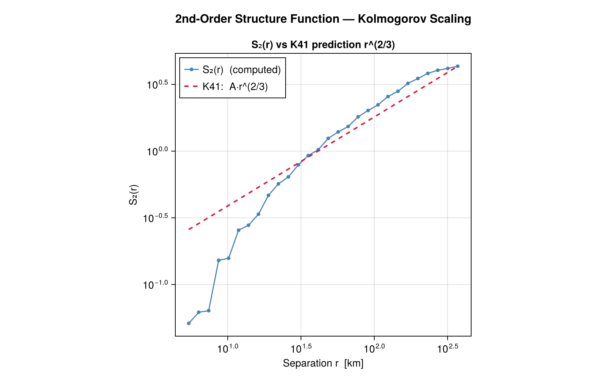
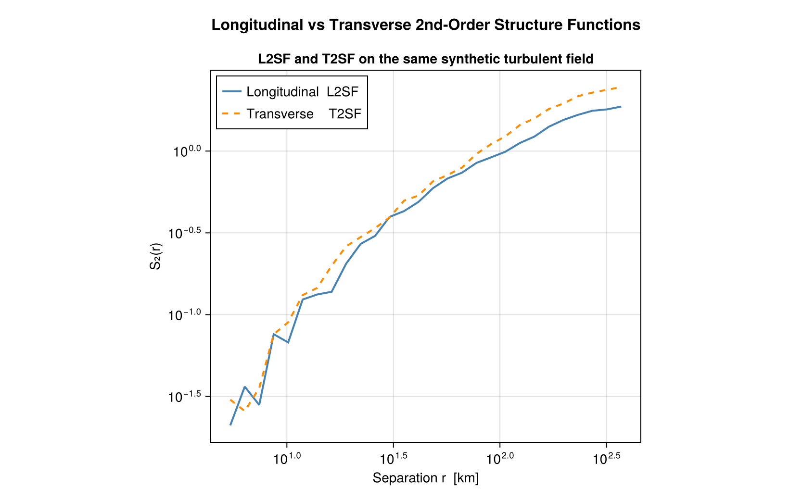
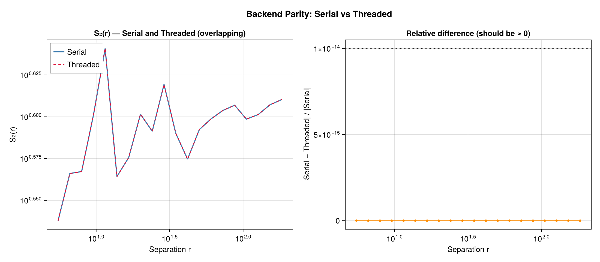
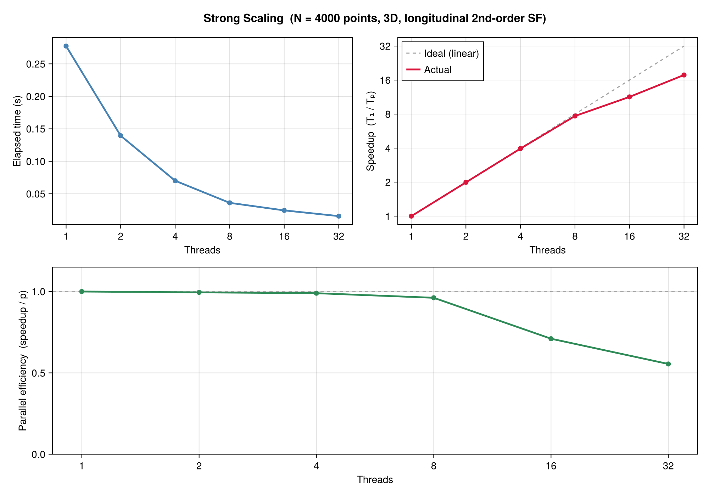
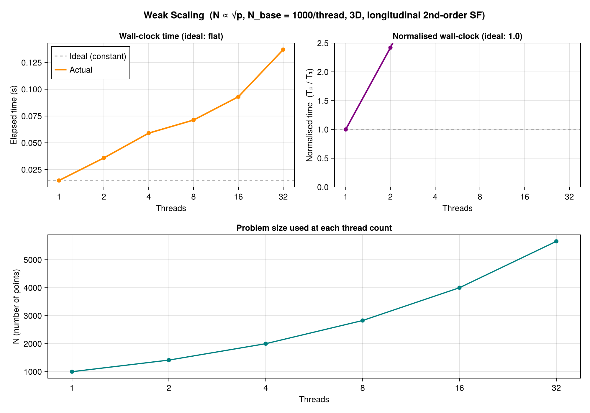

# StructureFunctions.jl v0.3.0

[![DOI][zenodo-img]][zenodo-latest-url]

[zenodo-img]: https://zenodo.org/badge/734119226.svg
[zenodo-latest-url]: https://doi.org/10.5281/zenodo.14945669

**High-performance structure function calculations for turbulence and spatial correlation analysis.**

StructureFunctions.jl computes structure functions (SFs) from scattered data, characterizing spatial correlations and scaling properties of turbulent/spatially-varying fields. Optimized for multi-dimensional data with typed backends supporting serial, threaded, distributed, and GPU execution.

## Table of Contents

- [Features](#features)
- [Quick Start](#quick-start)
- [Architecture](#architecture)
- [Backends](#backends)
- [API Reference](#api-reference)
- [Theory & References](#theory--references)
- [Performance](#performance)
- [Extensions](#extensions)
- [Migration from v0.2](#migration-from-v02)
- [Examples](#examples)

## Features

- **Structure Functions**: 1st, 2nd, 3rd order; longitudinal & transverse projections in 1D, 2D, 3D
- **In-place Mutating API**: Pre-allocated mutating functions (`calculate_structure_function!`) for zero-allocation loops (O(n_threads) multi-threaded chunked allocations)
- **2D Joint-Probability Binning**: Natively accumulates both exact sums and contribution counts across distance and structure function value increment bins (`StructureFunction2D`)
- **Typed Backend System**: Serial, Threaded, Distributed, GPU, Auto — choose your parallelization strategy
- **Type-Stable Dispatch**: No runtime overhead from symbolic dispatch; all paths validated with JET
- **Extensible Architecture**: Optional extensions for parallelization and GPU acceleration
- **Production Ready**: Comprehensive test coverage, numerical validation, performance benchmarking
- **Modern Julia**: Julia 1.12+ with qualified imports and explicit type annotations

## Quick Start

```julia
using StructureFunctions: Calculations as SFC, StructureFunctionTypes as SFT

# 2D data: 3 points
x = ([0.0, 1.0, 2.0], [0.0, 0.0, 0.0])
u = ([1.0, 1.1, 1.2], [0.0, 0.05, 0.1])

# Distance bins (physical units)
bins = [(0.0, 1.0), (1.0, 2.0), (2.0, 3.0)]

# Calculate 2nd-order longitudinal SF
sf_type = SFT.LongitudinalSecondOrderStructureFunctionType()
result = SFC.calculate_structure_function(sf_type, x, u, bins)

# result.values contains the SF values for each bin
println("SF values: ", result.values)

# Speed it up with threading (if available)
using Base.Threads
if nthreads() > 1
    result_threaded = SFC.calculate_structure_function(
        sf_type, x, u, bins;
        backend=SFC.ThreadedBackend()
    )
end
```

### Pre-allocated In-place Calculation

For high-performance loops (e.g. over timesteps), you can pre-allocate memory buffers and run mutating calculations with zero heap allocation:

```julia
using StructureFunctions: Calculations as SFC, StructureFunctionTypes as SFT

x = ([0.0, 1.0, 2.0], [0.0, 0.0, 0.0])
u = ([1.0, 1.1, 1.2], [0.0, 0.05, 0.1])
bins = [(0.0, 1.0), (1.0, 2.0), (2.0, 3.0)]
sf_type = SFT.L2SFType()

# Pre-allocate output arrays
n_bins = length(bins)
sums = zeros(Float64, n_bins)
counts = zeros(Float64, n_bins)

# Compute in-place (accumulates into provided buffers)
SFC.calculate_structure_function!(sums, counts, sf_type, x, u, bins; backend=SFC.ThreadedBackend())

# Obtain structure function values via division
sf_values = sums ./ counts
```


## Architecture

### Operator Types ✕ Result Container Pattern

The v0.3.0 API separates **operators** (structure function definitions) from **result containers** (computed outcomes):

```
AbstractStructureFunctionType (operators)
  ├── LongitudinalSecondOrderStructureFunctionType
  ├── TransverseSecondOrderStructureFunctionType
  ├── LongitudinalThirdOrderStructureFunctionType
  └── ... (3+ other variants)

StructureFunction (result container)
  ├── operator::AbstractStructureFunctionType
  ├── distance_bins::AbstractVector
  ├── values::AbstractVector
  └── order::Int
```

This split ensures:
- Clear semantics: operators are **inputs**, containers are **outputs**
- Type stability: dispatch happens at compilation time
- Extensibility: custom operators and containers are easy to add

### Backend Dispatch System

```
calculate_structure_function(sf_type, x, u, bins; backend=AutoBackend())
    ↓
_dispatch_execution_backend(backend, ...)
    ├── SerialBackend       → serial_calculate_structure_function
    ├── ThreadedBackend     → threaded_calculate_structure_function (from OhMyThreadsExt)
    ├── DistributedBackend  → parallel_calculate_structure_function (from DistributedExt)
    ├── GPUBackend(b)       → gpu_calculate_structure_function (from GPUExt)
    └── AutoBackend         → (tries distributed → threaded → serial)
```

All code paths produce **numerically identical results** (validated by intensive test suite).

## Backends

### SerialBackend (Default Reference)

Single-threaded CPU execution. Use when:
- Debugging or validating calculations
- Data is small
- Deterministic execution is required

```julia
result = SFC.calculate_structure_function(sf_type, x, u, bins)  # Defaults to Serial
result = SFC.calculate_structure_function(sf_type, x, u, bins; 
                                        backend=SFC.SerialBackend())
```

**Performance**: O(N²) pairwise distance/SF evaluations.  
**Memory**: O(N + B) where N = points, B = distance bins.

### ThreadedBackend (Multi-CPU)

Multi-threaded execution using [OhMyThreads.jl](https://github.com/JuliaFolds2/OhMyThreads.jl).

```julia
using Base.Threads

result = SFC.calculate_structure_function(sf_type, x, u, bins;
                                        backend=SFC.ThreadedBackend())
```

- **Prerequisites**: `Threads.nthreads() > 1`
- **Thread-local reductions**: No locks or atomic operations
- **Speedup**: Near-linear up to ~4 threads; diminishing returns beyond (memory bandwidth limit)

### DistributedBackend (Multi-Process/Cluster)

Multi-worker execution using [Distributed.jl](https://docs.julialang.org/en/v1/stdlib/Distributed/).

```julia
using Distributed: addprocs

addprocs(4)  # Or specify SSH workers, etc.

result = SFC.calculate_structure_function(sf_type, x, u, bins;
                                        backend=SFC.DistributedBackend())
```

- **Prerequisites**: Workers launched via `addprocs()` or similar
- **Communication overhead**: One `@distributed` reduction loop
- **Ideal for**: Large datasets, compute clusters

### GPUBackend (GPU Acceleration)

GPU execution via [KernelAbstractions.jl](https://github.com/JuliaGPU/KernelAbstractions.jl).

```julia
using KernelAbstractions as KA

# NVIDIA GPU (after loading CUDA.jl)
using CUDA
result = SFC.calculate_structure_function(sf_type, x, u, bins;
                                        backend=SFC.GPUBackend(CUDA.CUDABackend()))

# AMD GPU (after loading AMDGPU.jl)
using AMDGPU
result = SFC.calculate_structure_function(sf_type, x, u, bins;
                                        backend=SFC.GPUBackend(AMDGPU.ROCBackend()))

# CPU backend for testing (no GPU required)
result = SFC.calculate_structure_function(sf_type, x, u, bins;
                                        backend=SFC.GPUBackend(KA.CPU()))
```

- **Ideal for**: Very large datasets (1M+ points) where GPU memory is sufficient
- **Kernel architecture**: Embarrassingly parallel pairwise loops
- **Precision**: Full precision maintained; mixed-precision kernels supported

### AutoBackend (Recommended Default)

Automatic selection based on environment:

```julia
result = SFC.calculate_structure_function(sf_type, x, u, bins;
                                        backend=SFC.AutoBackend())

# Selection order:
# 1. Distributed  (if nworkers() > 1)
# 2. Threaded     (if nthreads() > 1)
# 3. Serial       (fallback)
```

## API Reference

### Main Entry Points

**1. Standard Allocating API:**

```julia
calculate_structure_function(sf_type::AbstractStructureFunctionType,
                            x::Union{Tuple, Matrix},
                            u::Union{Tuple, Matrix},
                            distance_bins::AbstractVector{<:Tuple};
                            backend=SerialBackend(),
                            return_sums_and_counts=false,
                            distance_metric=Euclidean(),
                            verbose=true,
                            show_progress=true) → StructureFunction
```

**2. 2D Joint-Probability Allocating API:**

```julia
calculate_structure_function(sf_type::AbstractStructureFunctionType,
                            x::Union{Tuple, Matrix},
                            u::Union{Tuple, Matrix},
                            distance_bins::AbstractVector{<:Tuple},
                            value_bins::AbstractVector;
                            backend=SerialBackend(),
                            distance_metric=Euclidean(),
                            verbose=true,
                            show_progress=true) → StructureFunction2D
```

**3. In-place Mutating API (Zero-Allocation):**

```julia
calculate_structure_function!(sums::AbstractVector,
                             counts::AbstractVector,
                             sf_type::AbstractStructureFunctionType,
                             x::Union{Tuple, Matrix},
                             u::Union{Tuple, Matrix},
                             distance_bins::AbstractVector;
                             backend=SerialBackend(),
                             distance_metric=Euclidean(),
                             verbose=true,
                             show_progress=true) → Nothing
```

**4. 2D Joint-Probability Mutating API (Zero-Allocation):**

```julia
calculate_structure_function!(sums_2d::AbstractMatrix,
                             counts_2d::AbstractMatrix,
                             sf_type::AbstractStructureFunctionType,
                             x::Union{Tuple, Matrix},
                             u::Union{Tuple, Matrix},
                             distance_bins::AbstractVector,
                             value_bins::AbstractVector;
                             backend=SerialBackend(),
                             distance_metric=Euclidean(),
                             verbose=true,
                             show_progress=true) → Nothing
```

*Note: The mutating APIs accumulate (`+=` and `.+=`) directly into the provided output buffers. The caller is responsible for pre-zeroing the arrays.*

### Operator Types

All inherit from `AbstractStructureFunctionType`. Instantiate with `()` or use shorthands:

```julia
SFT.LongitudinalSecondOrderStructureFunctionType()    # 2nd order, longitudinal
SFT.TransverseSecondOrderStructureFunctionType()      # 2nd order, transverse
SFT.LongitudinalThirdOrderStructureFunctionType()     # 3rd order, longitudinal
# ... shorthands: L2SFType, T2SFType, L3SFType, T3SFType, S2SFType, S3SFType
```

Each operator is **callable** (functors):
```julia
sf_op = SFT.L2SFType()
sf_op(du, rhat)  # Computes L2SF increment value
```

### Result Containers

**1. 1D Structure Function Container (`StructureFunction`):**

```julia
struct StructureFunction{FT, OT, BT, VT} <: AbstractStructureFunction
    operator::OT                   # AbstractStructureFunctionType
    distance_bins::BT              # AbstractVector of (r_min, r_max)
    values::VT                     # AbstractVector{FT} — computed SF
    order::Int                     # 1, 2, 3, ...
end
```

**2. 2D Joint-Probability Container (`StructureFunction2D`):**

```julia
struct StructureFunction2D{FT, OT, BT, VT, MT} <: AbstractStructureFunction
    operator::OT                   # AbstractStructureFunctionType
    distance_bins::BT              # AbstractVector of (r_min, r_max)
    value_bins::VT                 # AbstractVector of value bin edges
    sums::MT                       # AbstractMatrix{FT} (distance x value)
    counts::MT                     # AbstractMatrix{FT} (distance x value)
end
```

**Access results**:
```julia
# 1D
result.values         # SF values, one per bin
result.distance_bins  # Original input bins

# 2D
result_2d.sums        # Sum of SF values in each 2D cell
result_2d.counts      # Count of point pairs in each 2D cell
```

## Theory & References

Structure functions quantify spatial correlations of a field **u** at separation distance **r**:

$$S_p(r) = \langle |u(\mathbf{x} + \mathbf{r}) - u(\mathbf{x})|^p \rangle$$

where $\langle \cdot \rangle$ is ensemble/spatial average over all displacement vectors $\mathbf{r}$.

### Dimensional Variants

- **1D**: Single coordinate axis (e.g., time series)
- **2D**: Horizontal plane (e.g., satellite imagery)
- **3D**: Full spatial field (e.g., atmospheric snapshots)

### Order Variants

- **1st order** ($p=1$): Absolute increment
- **2nd order** ($p=2$): Energy-like; related to kinetic energy spectrum by Wiener-Khinchin
- **3rd order** ($p=3$): Skewness; tests Kolmogorov refined similarity hypotheses

### References

1. **Kolmogorov (1941)**: _The Local Structure of Turbulence in Incompressible Viscous Fluid for Very Large Reynolds Numbers_  
   - Foundational theory; predicts $S_2(r) \sim r^{2/3}$ in inertial range

2. **Balwada et al. (2016)**: _Scale-aware analysis of satellite sea surface temperature variability_  
   - Applied SF analysis to geophysical gridded data; demonstrates multi-scale recovery

3. **Wikipedia**: [Turbulence](https://en.wikipedia.org/wiki/Turbulence#Kolmogorov's_theory_of_1941)  
   - Accessible overview of Kolmogorov theory

**See also**: `docs/theory.md` for detailed mathematical formulations and dimensional projections.

## Example Figures

### 2nd-Order Structure Function — Kolmogorov Scaling



*2nd-order longitudinal structure function on a 2D turbulent field. Dashed line: K41 prediction S₂(r) ~ r^(2/3).*

### Longitudinal vs Transverse Structure Functions



*Comparison of longitudinal (L2SF) and transverse (T2SF) 2nd-order structure functions on the same field.*

### Backend Parity Validation



*Serial vs Threaded backend results on identical data — differences are at floating-point rounding level.*

---

## Performance

### Scaling Characteristics

| Dimension | Metric | Value |
|-----------|--------|-------|
| N points  | Algorithm | O(N²) |
| B bins    | Space | O(N + B) |
| D dim's   | CPU ops | ~D² per pair |
| Threads   | Speedup | ~0.8–0.9× per thread (dims ≤ 3) |

### Benchmark Figures (v0.3.0, Julia 1.12)

> **Hardware:** 2× Intel Xeon Gold 6426Y (16 cores / 32 threads each, 64 logical CPUs total).
> Benchmarks were run on this machine. Results on other hardware will differ.
> To regenerate with your own hardware, see [`benchmark/benchmark_scaling.jl`](benchmark/benchmark_scaling.jl).
> Output figures land in `benchmark/benchmark_results/` (gitignored).

#### Strong Scaling — fixed N, increasing threads



*Fixed problem size (N = 4000 points, 3D, longitudinal 2nd-order SF). Speedup approaches linear up to ~4 threads; NUMA effects reduce efficiency beyond 8 threads on a dual-socket system.*

#### Weak Scaling — N ∝ √p, constant work per thread



*Problem size grows as N = N_base × √p so each thread has constant O(N²/p) pair work. Ideal wall-clock time is flat; observed rise reflects inter-socket memory traffic.*

### Optimization Tips

1. **Use AutoBackend** for deployment (automatic tuning)
2. **Prefer larger datasets** for threading overhead to amortize
3. **Pre-sort bins** by distance to improve cache locality
4. **Use Float32** if precision allows (faster GPU transfers)
5. **Batch multiple SFs** by reusing distance calculations

## Extensions

Optional packages extend StructureFunctions with additional functionality:

### OhMyThreadsExt (ThreadedBackend)

Loaded automatically when `OhMyThreads.jl` is in `Project.toml`:

```toml
[extras]
OhMyThreads = "67456a42-ebe4-4781-8ad1-67f7eda8d8f7"

[extensions]
StructureFunctionsOhMyThreadsExt = "OhMyThreads"
```

### DistributedExt (DistributedBackend)

Requires `Distributed.jl` (stdlib) + `SharedArrays.jl` (stdlib):

```julia
using Distributed: addprocs
addprocs(4)
backend = StructureFunctions.DistributedBackend()
```

### GPUExt (GPUBackend)

Requires `KernelAbstractions.jl` + GPU package (CUDA.jl, AMDGPU.jl, etc.):

```toml
[extras]
KernelAbstractions = "63c18a36-062a-441e-b365-b594b6ce51b1"

[extensions]
StructureFunctionsGPUExt = "KernelAbstractions"
```

## Migration from v0.2

### Breaking Changes

| v0.2 | v0.3 |
|------|------|
| Symbol-based backend selection | Typed backend objects |
| `backend=:serial` | `backend=SerialBackend()` |
| `backend=:threaded` | `backend=ThreadedBackend()` |
| `backend=:distributed` | `backend=DistributedBackend()` |
| No GPU support | `backend=GPUBackend(...)` |

### Recommended Updates

```julia
# OLD (v0.2)
result = calculate_structure_function(sf, x, u, bins; backend=:threaded)

# NEW (v0.3)
result = calculate_structure_function(sf, x, u, bins; backend=ThreadedBackend())

# Or use AutoBackend for automatic selection:
result = calculate_structure_function(sf, x, u, bins)  # Defaults to AutoBackend()
```

### Compatibility

- v0.3 is **not** backward-compatible with v0.2 scripts
- Update scripts by replacing symbol backends with typed backends
- See `CHANGELOG.md` for full change log

## Examples

Detailed worked examples are in `examples/` directory:

- `simple_2d.jl`: Basic 2D structure function calculation
- `threaded_calculation.jl`: Multi-threaded execution
- `gpu_acceleration.jl`: GPU acceleration with KernelAbstractions  
- `distributed_parallel.jl`: Multi-process execution
- `real_data_climate.jl`: Processing real climate/turbulence data
- `custom_operator.jl`: Defining custom SF operators

Clone and run:

```bash
cd examples/
julia simple_2d.jl
julia threaded_calculation.jl
```

## Contributing

Contributions welcome! Please:

1. Fork and create a feature branch
2. Add tests for new functionality
3. Ensure full test suite passes: `julia test/runtests.jl`
4. Document changes in docstrings and `CHANGELOG.md`

## License

See `LICENSE` file.

## Citation

If you use StructureFunctions.jl in research, please cite:

```bibtex
@software{structurefunctions_jl_2024,
  author = {Benjamin, Jordan and Contributors},
  title = {StructureFunctions.jl: High-performance structure function calculations},
  year = {2024},
  doi = {10.5281/zenodo.14945669},
  url = {https://zenodo.org/records/14945669}
}
```

---

**Last Updated**: March 2026 | **Version**: 0.3.0 | **Julia**: 1.12+
