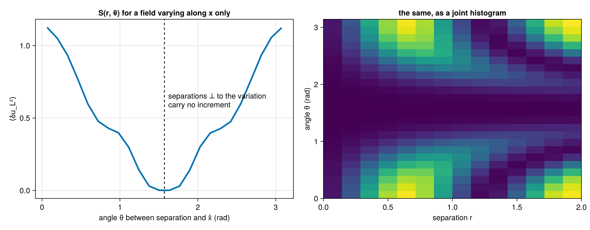
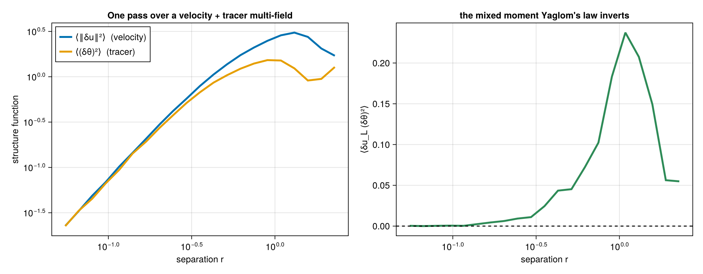
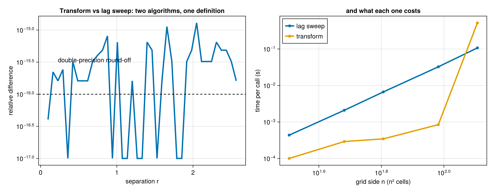
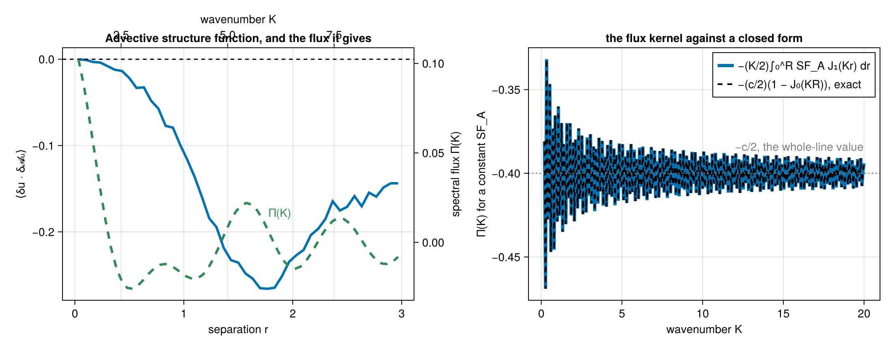
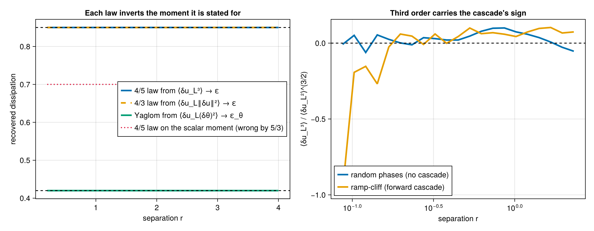
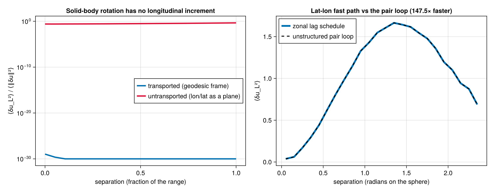
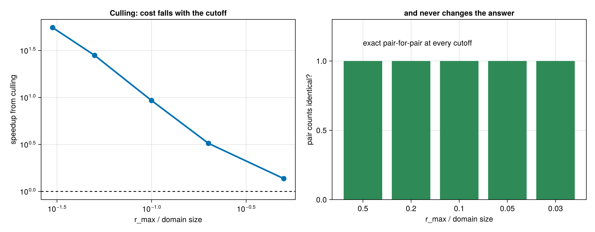
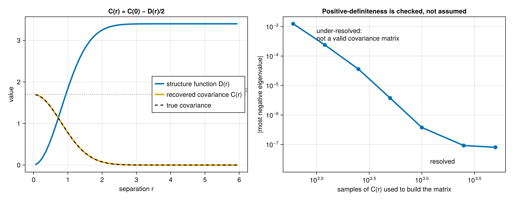

# StructureFunctions.jl

[![Docs (stable)][docs-stable-img]][docs-stable-url] [![Docs (dev)][docs-dev-img]][docs-dev-url] [![DOI][zenodo-img]][zenodo-latest-url]

[docs-stable-img]: https://img.shields.io/badge/docs-stable-blue.svg
[docs-stable-url]: https://jbphyswx.github.io/StructureFunctions.jl/stable/
[docs-dev-img]: https://img.shields.io/badge/docs-dev-blue.svg
[docs-dev-url]: https://jbphyswx.github.io/StructureFunctions.jl/dev/
[zenodo-img]: https://zenodo.org/badge/734119226.svg
[zenodo-latest-url]: https://doi.org/10.5281/zenodo.14945669

**Structure functions of turbulent and spatially varying fields, on point lists, multi-fields, grids
and the sphere, with the spectra, fluxes and fits derived from them.**

A structure function is the pair average of a polynomial in the increment `δu = u(x + r) − u(x)`,
binned in the separation `|r|`. This package computes them at any order, for longitudinal and
transverse projections, scalars, mixed and cross-field moments, and the moment tensor.

- [Documentation](https://jbphyswx.github.io/StructureFunctions.jl/dev/) — theory, walkthrough,
  architecture, backends, GPU, extensions, validation, API.
- Julia 1.12 or later.

## Quick start

```julia
using Pkg; Pkg.add(url = "https://github.com/jbphyswx/StructureFunctions.jl.git")

using StructureFunctions: Calculations as SFC, StructureFunctionTypes as SFT, LogBinEdges
using ComputationalBackends: ComputationalBackends as CB

x = rand(2, 4096) .* 1.0e4          # (D, N) coordinates
u = randn(2, 4096)                  # (D, N) velocity components
bins = LogBinEdges(collect(exp10.(range(log10(50.0), log10(5.0e3); length = 41))))

sf = SFC.calculate_structure_function(SFT.L2SFType(), x, u, bins)     # ⟨δu_L²⟩ per bin, AutoBackend
sf.values                                                             # NaN where a bin holds no pair
raw = SFC.calculate_structure_function(SFT.L2SFType(), x, u, bins; output_type = SFC.StructureFunctionObjects.StructureFunctionSumsAndCounts)
raw.sums, raw.counts                                                  # the accumulator, adds across processes and time

res = SFC.calculate_structure_functions_single_pass(x, u, bins)       # S2, L2, T2, S3, L3, L1T2 and the Helmholtz split in one pass
joint = SFC.calculate_structure_function(SFT.L3SFType(), x, u, bins, range(-3.0, 3.0; length = 61))   # distance × value histogram
```

Threads: start Julia with `-t N` and `using OhMyThreads`. A GPU: `using KernelAbstractions, CUDA` and
`backend = CB.GPUBackend(CUDA.CUDABackend())`. A grid: `using FlowGeometries, FFTW` and pass the grid
and a spectral tag (below). The optional routes live in package extensions, listed under
[Extensions](#extensions).

## What it computes

**Operators.** Each is callable on a pair as `sf(δu, r̂)` and is accumulated by every route:

| operator | value on a pair | shorthand |
|---|---|---|
| `SecondOrderStructureFunctionType` | `‖δu‖²` | `S2SFType` |
| `ProjectedStructureFunctionType{NL, NT}(basis)` | `δu_L^NL · δu_T^NT` — `δu_L = δu·r̂`; `NT = 2` the transverse energy `‖δu‖² − δu_L²`, any other `NT` the signed component along the convention's transverse direction | `L2SFType` `{2,0}`, `T2SFType` `{0,2}`, `L3SFType` `{3,0}`, `L1T2SFType` `{1,2}`, `L2T1SFType` `{2,1}`, `T3SFType` `{0,3}` |
| `ThirdOrderStructureFunctionType` | `δu_L ‖δu‖²` | `S3SFType` |
| `FullVectorStructureFunctionType{NF}` | `‖δu‖^NF` | |
| `ScalarStructureFunctionType{P}(field)` | `(δθ)^P` | `ScalarSFType` |
| `MixedStructureFunctionType{NL, NT, P}` | `δu_L^NL ‖δu_T‖^NT (δθ)^P` — `{1,0,2}` is Yaglom's moment | `MixedSFType` |
| `VectorDotStructureFunctionType(a, b)`, `ScalarDotStructureFunctionType(a, b)` | `δu⁽ᵃ⁾·δu⁽ᵇ⁾`, `δθ⁽ᵃ⁾ δθ⁽ᵇ⁾` — the advective moments the flux relations take | `VectorDotSFType`, `ScalarDotSFType` |
| `MomentTensorOperator{P}` | the tensor `δu_{i₁} ⋯ δu_{i_P}` | |

The transverse convention travels with the operator (`CanonicalTransverseBasis()` by default,
`ReferenceAxisTransverseBasis(a)` about an axis), and operators odd in a scalar increment read every
pair in its canonical orientation, so nothing depends on the order of the input.

**Inputs**

- Point lists `x::(D, N)`, `u::(D, N)`; batches `u::(D, N, aux...)` with shared or varying positions.
- Multi-fields `MultiFields.Fields(vectors = (u, 𝓐u), scalars = (θ,))`, swept together in one pass.
- Grids from [FlowGeometries.jl](https://github.com/jbphyswx/FlowGeometries.jl): uniform, stretched
  (any number of uniform axes) and lat-lon grids, with masks (`NaN`s or a `Bool` mask) at every order.
- The sphere: `SphericalDistance(R)` (or `Distances.Haversine`, `Distances.SphericalAngle`) puts each
  pair in its geodesic frame; `x` is `(lon, lat)` and `u` may carry a radial component.
- Pair weights, one per point or cell (`cell_measure(grid)` for areas).

**Routes**

| data | route | exact? |
|---|---|---|
| point list, any geometry | blocked pair loop with cell culling, on every backend | yes |
| one-dimensional point list | sorted route, prefix sums of monomials, `O(N log N + N n_bins)` | yes |
| grid with ≥ 1 uniform axis | direct lag sweep, or the transform engine: each polynomial operator at each lag as cross-correlations of masked monomials, on the CPU or a device | yes |
| lat-lon grid | the same, with the geodesic frame per lag (pole-invariant) | yes |
| sphere, any point set | the harmonic route: pseudo-spectral series with Legendre / Wigner-d kernels (`HarmonicNodes`) | kernel-binned, exact for a band-limited field on a quadrature grid |
| scattered points, large | non-uniform FFT onto a mode grid (`ScatteredModesSchedule`) | no: soft-binned, converges with the mode count |

**Outputs beyond the histogram**

- Joint histograms in (distance × value) and (distance × angle); moment tensors of any rank on points
  and grids; the six isotropic invariants and the Helmholtz rotational/divergent split in one pass.
- Spectra: `isotropic_spectrum` in 1-, 2- and 3-D; `gridded_spectrum` exactly through the lag space
  (and an unbiased estimate with cells missing); `helmholtz_spectra` (`E`/`B`) by `J₀`/`J₂`; on the
  sphere `C_l`, `C^E_l`, `C^B_l`.
- Fluxes: `spectral_flux` from the advective moment (`J₁`) and from `S3`, `L3` with their boundary
  terms; `enstrophy_flux`.
- Fits (issue #37): `fit_spectrum`, `fit_helmholtz_spectra`, `fit_flux` through
  `SpectrumForwardModel`, `HelmholtzForwardModel`, `FluxForwardModel` with `RegularizedLeastSquares`
  (posterior covariance), `NonNegativeLeastSquares` or a `SegmentedPowerLaw`; `tradeoff_curve`,
  `select_segments`, `independent_pair_variance`.
- Exact laws: `KHM.epsilon_from_four_fifths`, `epsilon_from_four_thirds`, `epsilon_theta_from_yaglom`.

## A grid, by transform

```julia
using FlowGeometries: FlowGeometries as FG
using SpectralBackends: SpectralBackends as SB
using FFTW

n_lon, n_lat = 1440, 720
grid = FG.Grids.StructuredGrid(FG.Geometry.SphericalGeometry(6.371e6),
                               range(0.0, step = 2π / n_lon, length = n_lon),
                               range(-π / 2 + π / (2n_lat), π / 2 - π / (2n_lat); length = n_lat))
u = randn(2, n_lon, n_lat)                                  # (east, north) at every cell
bins = 6.371e6 .* collect(range(0.0, π; length = 41))       # metres, like the radius

sf = calculate_structure_function(SFT.L3SFType(), grid, u, bins, UInt64,
                                  SB.FastFourierTransformSpectralBackend(); backend = CB.ThreadedBackend())
```

That bins `5.4 × 10¹¹` pairs in about ten seconds on eight cores; the direct sweep of the same grid
takes 60× longer and returns the same counts. The same call with `backend = CB.GPUBackend(...)` runs
the engine on a device.

## Extensions

| load | adds |
|---|---|
| `OhMyThreads` | `ThreadedBackend()` |
| `Distributed`, `MPI` | `DistributedBackend()`, the MPI backend |
| `KernelAbstractions` (+ `CUDA`) | `GPUBackend(device)` on every device route |
| an `AbstractFFTs` package (`FFTW`) | the transform engine; + `KernelAbstractions` for the device engine |
| `FlowGeometries` | the grid entries and `cell_measure` |
| `Bessels` | the 2-D kernel, the flux relations, the Helmholtz spectra and forward models |
| `NUFSHT` | the fast harmonic route on the sphere |
| `NonuniformFFTs`, `FINUFFT` | the soft-binned scattered-points route, one provider tag each (`NonuniformFFTsSpectralBackend`, `FINUFFTSpectralBackend`) |
| `LsqFit` | the segmented power-law fit |

The algorithm tags (`AutoSpectralBackend()`, `FastFourierTransformSpectralBackend()`, …) come from
`SpectralBackends`, a dependency.

## Figures


*2nd-order longitudinal structure function on a 2-D turbulent field; dashed: K41 `S₂ ~ r^(2/3)`.*


*Longitudinal (`L2SF`) and transverse (`T2SF`) second-order structure functions of one field.*


*The six isotropic invariants and the Helmholtz decomposition, from one pair pass.*


*Conditional PDFs `P(value | r)` of the six invariants, for a symmetric random field (top) and a
forward-cascade field (bottom). The signed third-order panels skew negative only for the cascade.*


*Serial against threaded on identical data: differences at floating-point rounding.*


*Left: a field built with `E(k) ~ k^(-5/3)`, binned into `S₂` and transformed back with
`gridded_spectrum` + `shell_average`. Right: the isotropic transform against a closed-form Gaussian
density in 1-, 2- and 3-D, to `6.6e-05`, `2.3e-09` and `9.9e-14`.*


*With half the grid missing, the spectrum recovered through `S₂` is within a few percent of the
complete-field answer. Zero-filling the gaps and transforming directly is off by about 80 %.*



*The second histogram axis can bin the angle to a reference direction: `S(r, θ)` from the same kernel.*


*The rotational and divergent split, in separation and in wavenumber. The two spectra sum to the
trace's exactly, because `D_rot + D_div = D_LL + D_TT` and the transform is linear.*



*A `Fields(vectors = (u,), scalars = (θ,))` multi-field: velocity, tracer and mixed moments in one pass;
right, Yaglom's `⟨δu_L (δθ)²⟩`.*



*Two exact algorithms for one definition agree to round-off. The transform's cost does not grow with
the number of lags.*



*`⟨δu · δ𝓐ᵤ⟩` with the flux `Π(K) = −(K/2)∫ SF_A J₁(Kr) dr`, and the kernel against its closed form:
a constant advective structure function gives exactly `−(c/2)(1 − J₀(KR))`.*



*Left: each law recovers the constant it prescribes, flat in `r`, from the moment it is stated for.
The red line applies the four-fifths law to `S3SF`, which overstates `ε` by 5/3. Right: a
random-phase field has vanishing odd moments, a ramp-cliff field is negatively skewed at small
separations.*



*Solid-body rotation has no strain, so the geodesic frame gives `D_LL` at machine zero while a flat
lon/lat frame puts most of the energy into it. Right: the zonal route on a lat-lon grid.*



*The cost falls with the cutoff; the pair counts are identical at every cutoff.*



*`C(r) = C(0) − D(r)/2` given the variance. The covariance matrix is tested for positive
semi-definiteness; an under-resolved sampling cannot support a valid one.*


*A lat-lon cell shrinks toward the poles, so `weights = cell_measure(grid)` turns the pair average
into an area average; every lag route and point entry takes the keyword.*


*One-dimensional point lists take an exact route built on prefix sums of the monomials, so the cost
stops scaling with the pair count. It returns the pair loop's answer. A norm power is not a
polynomial and keeps the loop.*


*The transform already forms each lag's symmetric moment store, so the tensor costs no more than the
scalar. Its components hold the anisotropy the trace averages away, and that trace is the scalar
second-order entry.*


*`ScatteredModesSchedule` puts scattered points on a mode grid, so the pair statistic comes back with
the truncated kernel in place of a hard bin. The result carries `ModeBinEdges`. It is not exact at any
finite mode count and converges as the mode count grows; it is selected only by passing the tag.*


*A spectrum from `S₂` by a bounded segmented power law, and a spectral flux from `S₃`. These are
estimators with stated priors, beside the exact transforms they approximate: without a prior the
inversion is singular below `π/r_max`, which is what the regularisation is for.*

*Regenerate the sixteen feature figures with `julia --project=docs/generate_assets
docs/generate_assets/generate_feature_figures.jl`, and the six above them with
`generate_assets.jl` in the same environment.*

### Scaling


*Strong and weak scaling of the threaded point kernel (`benchmark/benchmark_scaling.jl`); one GPU
against the serial CPU over the problem size and over the slice count (`gpu/collect_benchmark_assets.jl`);
and the device kernel on `KernelAbstractions.CPU()` against the serial reference.*

## Validation

Routes are cross-checked against independent references: closed-form Fourier modes, the transform
against the direct sweep and the pair loop, analytic spectra and fluxes, the rotation average on the
sphere, and the backends against each other, CUDA included. The
[validation page](https://jbphyswx.github.io/StructureFunctions.jl/dev/validation/) lists the oracles
and the tolerance policy.

```bash
julia --project=test test/runtests.jl          # the suite (Aqua and JET included)
julia --project=gpu gpu/runtests.jl            # every CUDA suite, on a GPU node
julia --project=docs docs/make.jl              # the documentation, with every export checked
```

## Citation

```bibtex
@software{structurefunctions_jl,
  author = {Benjamin, Jordan},
  title  = {StructureFunctions.jl: structure functions, spectra and fluxes of turbulent fields},
  doi    = {10.5281/zenodo.14945669},
  url    = {https://github.com/jbphyswx/StructureFunctions.jl}
}
```

See `CHANGELOG.md` for what each version added and `LICENSE` for the terms.
