# StructureFunctions.jl

[Documentation](https://jbphyswx.github.io/StructureFunctions.jl/dev/) · [DOI](https://doi.org/10.5281/zenodo.14945669)

StructureFunctions computes statistics of field increments between pairs of positions: structure functions of any
order, longitudinal and transverse projections, scalar, mixed and cross-field moments, and moment tensors. It takes
point lists, batches of snapshots, structured grids and the sphere, and derives spectra, fluxes, covariances, fits and
the third-order exact laws from the results, on serial, threaded, Distributed, MPI and GPU backends.


## Installation

```julia
using Pkg: Pkg; Pkg.add(url="https://github.com/jbphyswx/StructureFunctions.jl.git")
```

## Calculate a structure function

Columns contain points; rows contain vector components. This example computes the mean squared longitudinal velocity increment in each separation bin.

```julia
using Random: Random
using StructureFunctions: Calculations as SFC, StructureFunctionTypes as SFT,
    StructureFunctionSumsAndCounts
using ComputationalBackends: SerialBackend

rng = Random.MersenneTwister(42)
x = Random.rand(rng, 2, 32)
u = Random.randn(rng, 2, 32)
bins = range(0.0, 1.5; length=9)
sf = SFC.calculate_structure_function(SFT.L2SFType(), x, u, bins;
    backend=SerialBackend())
sf.values
```

`sf.distance` contains bin edges. `sf.values` contains one mean per interval `(left, right]`; an empty bin has value `NaN`. Coordinate and velocity units are supplied by the caller.

## Accumulate snapshots

Raw sums and counts can be combined before taking a mean; pass the count type and the result type positionally after the bins. Mutating calculations add to their output buffers.

```julia
raw = SFC.calculate_structure_function(SFT.L2SFType(), x, u, bins, UInt64, StructureFunctionSumsAndCounts;
    backend=SerialBackend())
sums = copy(raw.sums)
counts = copy(raw.counts)
SFC.calculate_structure_function!(sums, counts, SFT.L2SFType(), x, u, bins;
    backend=SerialBackend())
@assert counts == 2 .* raw.counts
```

For shared positions, a field of shape `(D, N, snapshots...)` computes a separate histogram for each snapshot. Reusable workspaces retain preparation and scratch storage across repeated calculations.

## Mathematical quantities

| Quantity | Pair value |
|---|---|
| `S2SFType()` | `‖δu‖²` |
| `L2SFType()` | `δu_L²` |
| `T2SFType()` | `‖δu_T‖²`, summed over transverse components |
| `S3SFType()` | `δu_L ‖δu‖²` |
| `L3SFType()` | `δu_L³` |
| Scalar and mixed operators | Scalar increments and velocity–scalar products |
| Tensor calculation | Products of specified increment components |

A single-pass calculation shares pair geometry across six second- and third-order invariants. Joint histograms resolve separation and operator value or separation angle. Spherical calculations use transported pair frames.

## Methods and execution

Serial, threaded, Distributed, MPI, and GPU execution are selected through `ComputationalBackends`. Optional packages enable the corresponding extensions. Numerical methods include direct pairs, exact culling, sorted-line polynomial moments, direct gridded reductions, FFT correlations, and explicitly selected nonuniform or spherical transforms. Applicability depends on the operator and geometry; see the [backend guide](https://jbphyswx.github.io/StructureFunctions.jl/dev/backends/).

Load `OhMyThreads` for threaded execution and `KernelAbstractions, CUDA` for CUDA execution. Grid adapters use `FlowGeometries`; FFT methods use an `AbstractFFTs` provider such as `FFTW`. Unstructured inputs must contain valid points. Grid calculations support masks and invalid cells.

Spectrum and flux routines specify their dimensionality, normalization, and sampling assumptions in the [scientific analysis guide](https://jbphyswx.github.io/StructureFunctions.jl/dev/spectra/).

**Structure functions**

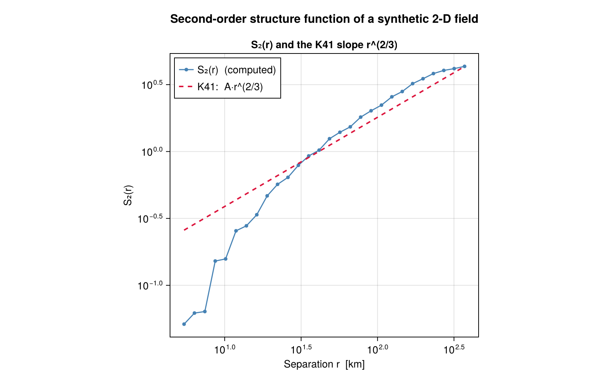

*The second-order structure function of a synthetic two-dimensional field, with the K41 slope `r^(2/3)`.*

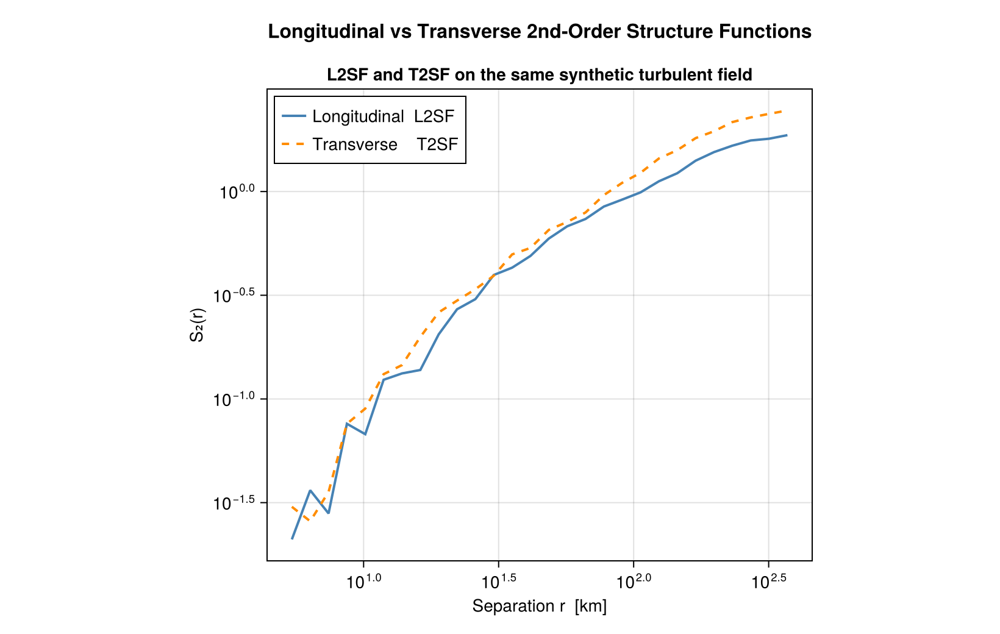

*Longitudinal (`L2SF`) and transverse (`T2SF`) second-order structure functions of one field.*

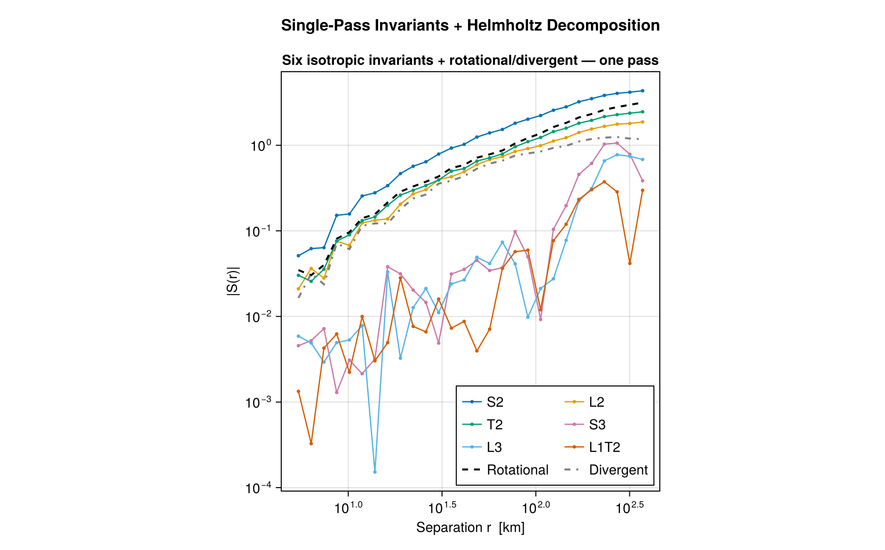

*The six isotropic invariants and the Helmholtz split, from one pass over the pairs.*

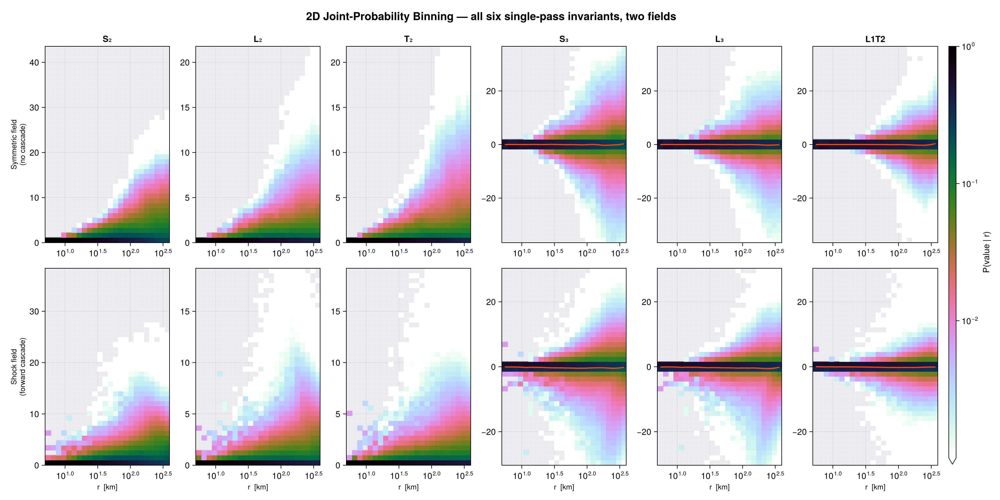

*Conditional distributions `P(value | r)` of the six invariants, for a symmetric field (top) and a forward-cascade
field (bottom); the signed third-order panels skew negative for the cascade.*

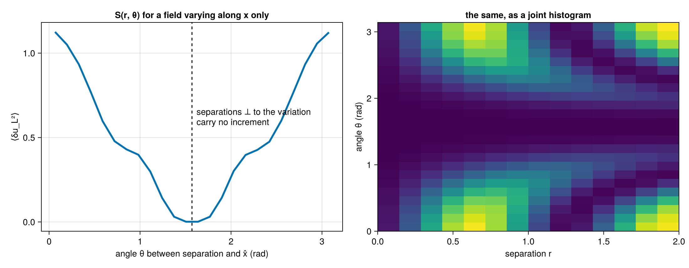

*`S(r, θ)` from the angle between the separation and a reference axis, for a field varying along `x`.*

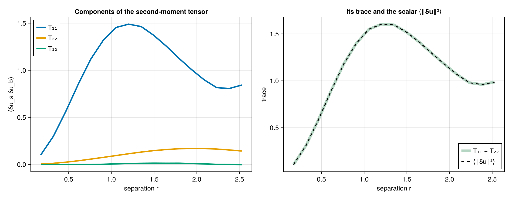

*The components of the second-moment tensor, and its trace, which is the scalar second-order structure function.*

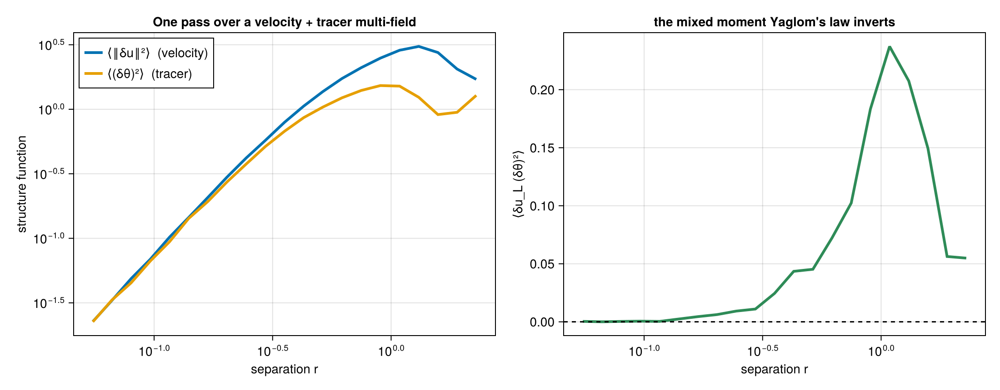

*Velocity, tracer and Yaglom's mixed moment `⟨δu_L (δθ)²⟩` from one multi-field.*

**Geometry and weights**

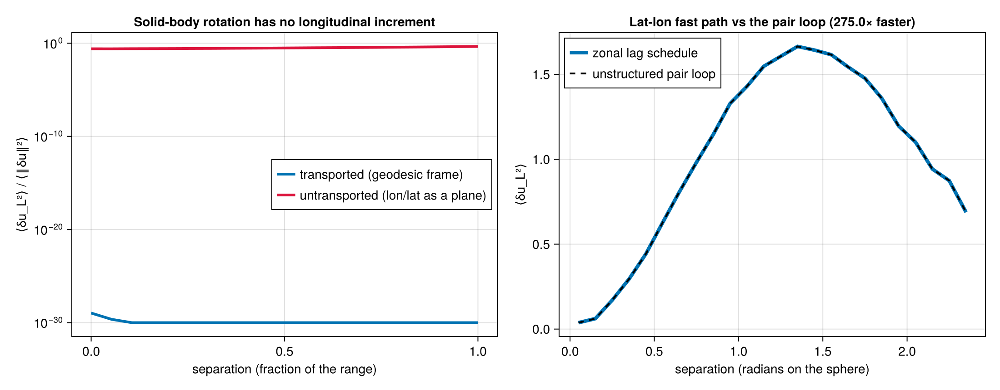

*A solid-body rotation has no longitudinal increment in the geodesic frame; a plane frame on longitude and latitude
puts most of its increment into `δu_L`. Right: the zonal lag schedule and the pair loop on one lat-lon grid.*

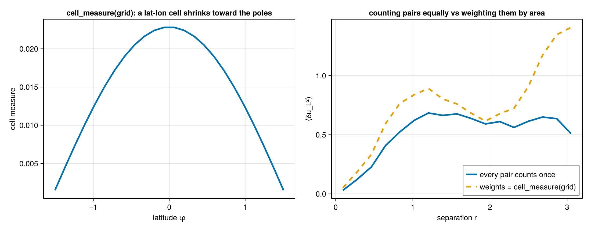

*`weights = cell_measure(grid)` turns the pair average on a lat-lon grid into an area average.*

**Exact routes and batches**

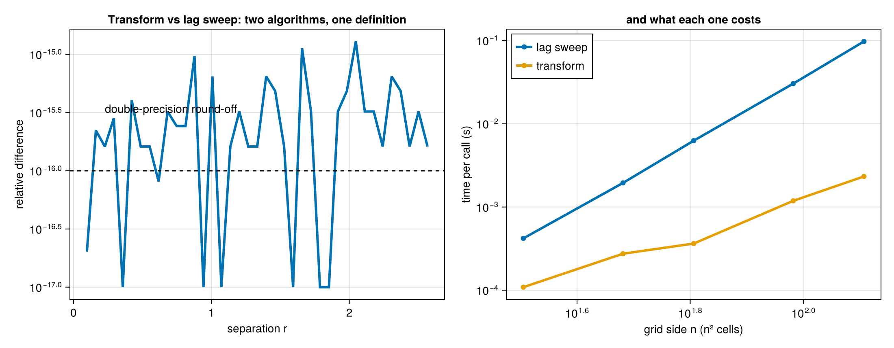

*The transform and the lag sweep agree to round-off on one grid; the transform's cost follows the grid size.*

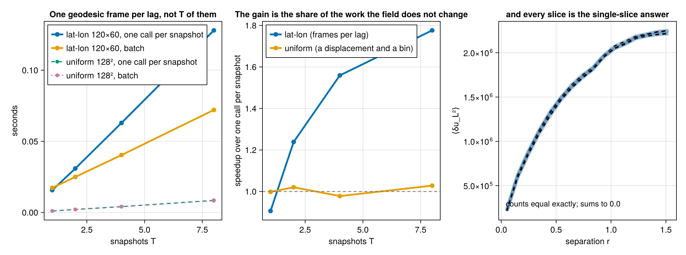

*`T` snapshots of one lat-lon grid in one call: the geometry is computed once, and each slice equals its
single-snapshot call.*

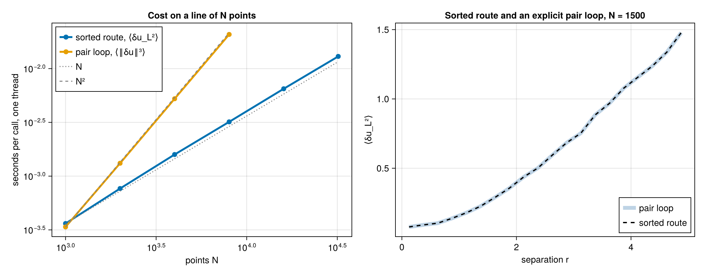

*Points on a line take the sorted route for a polynomial operator: prefix sums of the monomials over each bin's index
range, with the pair loop's result.*

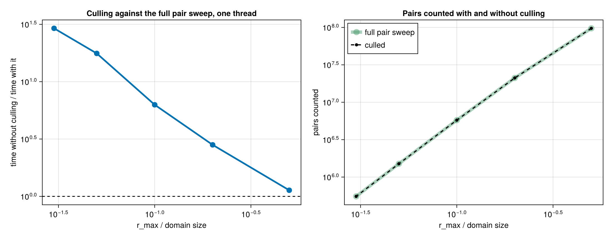

*Cell culling against the full pair sweep, and the pair counts of both at each cutoff.*

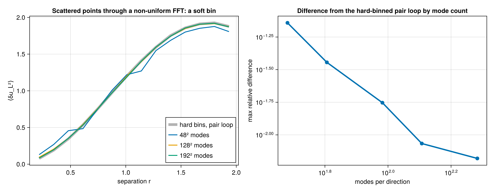

*`ScatteredModesSchedule` with a non-uniform FFT: kernel-binned, converging to the hard-binned result as the mode
count grows.*

**Spectra, fluxes and fits**


*A `k^(-5/3)` spectrum recovered from `S₂` on a grid, and the isotropic transform against a closed form in one, two
and three dimensions.*


*The spectrum with cells missing, against the complete field and a zero-filled FFT.*


*The Helmholtz split of a solenoidal field, and the rotational and divergent spectra of a solenoidal and an
irrotational field.*


*`C(r) = C(0) − D(r)/2` given the variance, and the positive-semi-definiteness check of the covariance matrix.*


*The advective structure function `⟨δu · δ𝓐ᵤ⟩`, the spectral flux `Π(K)` it gives, and the flux of a constant against
its closed form.*


*A spectrum fitted to `S₂` by a segmented power law, and a spectral flux fitted to `S₃` with and without a prior.*

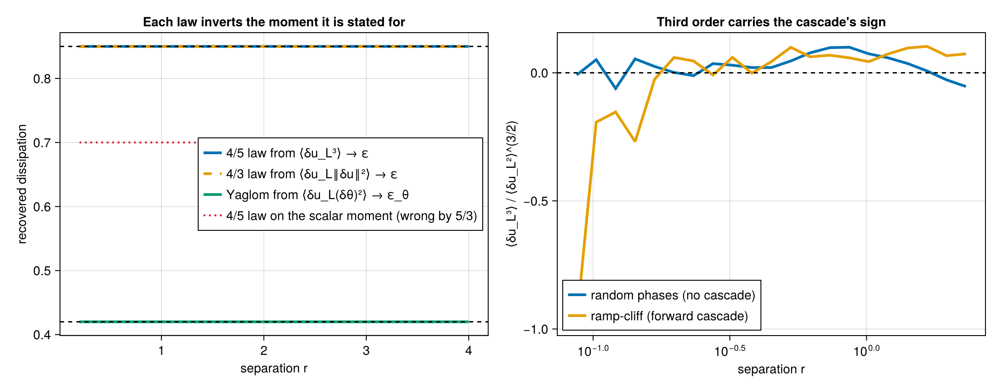

*Each law recovers the constant it prescribes from the moment it is stated for; the four-fifths law on `S3SF` gives
`5/3` times the dissipation. Right: the normalized third-order moment of a random-phase and a ramp-cliff field.*

**Backends**


*Serial and threaded results, and their relative difference.*


*The serial result and the device kernels on `KernelAbstractions.CPU()`.*

## Examples and development

See [`examples/`](examples/) for executable examples. The test suite runs with `julia --project=test test/runtests.jl`
and the CUDA suites with `julia --project=gpu gpu/runtests.jl` on a GPU node.

## Citation

```bibtex
@software{structurefunctions_jl,
  author = {Benjamin, Jordan},
  title  = {StructureFunctions.jl: structure functions, spectra and fluxes of turbulent fields},
  doi    = {10.5281/zenodo.14945669},
  url    = {https://github.com/jbphyswx/StructureFunctions.jl}
}
```
