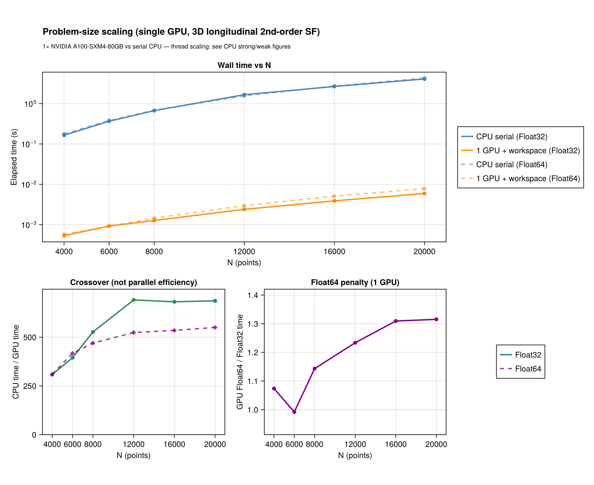
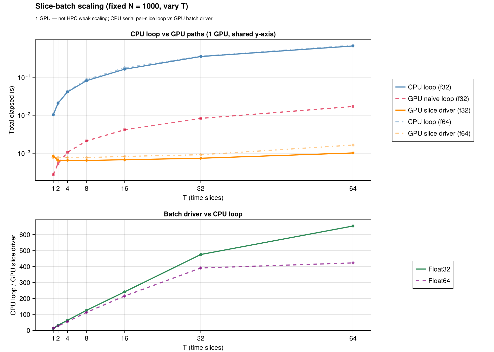

# GPU acceleration guide

StructureFunctions.jl provides GPU structure-function kernels via
[`StructureFunctionsGPUExt`](@ref) (loaded when `KernelAbstractions.jl` is available).
This guide covers production APIs: single snapshots, workspace reuse, and time-slice batches.

For backend selection across serial / threaded / distributed / GPU, see [backends.md](backends.md).
For prototype kernel research and SLURM benchmark scripts, see [`gpu/README.md`](../gpu/README.md).

## When to use the GPU

- **Problem size:** GPU pair histograms pay off when `N` is roughly **few×10³ and up**
  (exact crossover depends on hardware; see [benchmark figures](#benchmarks--figures)).
- **Memory:** Device arrays use layout `(N_dims, N_points)` or `(N_dims, N_points, T)` for batches.
  Prefer **Float32** on GPU for bandwidth; Float64 is supported but often much slower.
- **Not a drop-in speedup on CPU:** Without a GPU, `KA.CPU()` runs the same kernels on CPU and is
  slower than `ThreadedBackend()`.

## Single snapshot

```julia
using StructureFunctions: StructureFunctions as SF, Calculations as SFC
using KernelAbstractions: KernelAbstractions as KA
using CUDA: CUDA

backend = CUDA.functional() ? CUDA.CUDABackend() : KA.CPU()
N = 20_000
FT = Float32
x = CUDA.functional() ? CUDA.CuArray{FT}(rand(FT, 3, N)) : rand(FT, 3, N)
u = CUDA.functional() ? CUDA.CuArray{FT}(rand(FT, 3, N)) : rand(FT, 3, N)
bins = collect(FT, range(0.0f0, 1.5f0; length = 21))
sft = SF.LongitudinalSecondOrderStructureFunctionType()

result = SFC.gpu_calculate_structure_function(
    sft, backend, x, u, bins; return_sums_and_counts = true,
)
```

`distance_bins` must have the **same element type** as `x` and `u` (e.g. `Float32` fields →
`collect(Float32, edges)`). The GPU API does not cast bin edges silently.

### `GPUSFWorkspace` — reuse device histogram buffers

Repeated calls with the same bin layout should reuse a workspace to avoid reallocating
device histogram buffers each launch (~10–15% end-to-end win at `N=20k` on A100):

```julia
ws = SFC.GPUSFWorkspace(backend, bins)
for _ in 1:10
    SFC.gpu_calculate_structure_function(
        sft, backend, x, u, bins; workspace = ws, return_sums_and_counts = true,
    )
end
SFC.release!(ws)  # optional explicit free
```

## Time series — slice batch API

For `T` snapshots, stack data as **`(N_dims, N_points, T)`**, upload once, and call the slice driver:

```julia
T = 100
x_batch = rand(FT, 3, N, T)   # host or CuArray
u_batch = rand(FT, 3, N, T)

sums = zeros(FT, length(bins) - 1, T)
counts = zeros(UInt32, length(bins) - 1, T)
ws = SFC.GPUSFWorkspace(backend, bins)

SFC.gpu_calculate_structure_function_slices!(
    sums, counts, sft, backend, x_batch, u_batch, bins; workspace = ws,
)
```

**Avoid** a naive loop that uploads a host slice each `t` — that pays H2D + allocation every step.
The slice driver keeps the batch on device, reuses the workspace, and performs one final sync.

Public stubs with backend dispatch:

- `calculate_structure_function_slices!`
- `calculate_structure_function_2d_slices!`
- `calculate_structure_functions_single_pass_slices!` (GPU-only for now)
- `calculate_structure_functions_single_pass_2d!` — six `(dist × value)` histograms; GPU HTP-EJ when eligible

## Single-type joint 2D smem

[`GPUSFWorkspace`](@ref) for `kind=:joint2d` defaults to exact compile-time shared histogram width
`n_dist × n_val`. Optional override: `joint2d_compile_cells=joint2d_smem_max()` or
`joint2d_smem_align256(n_dist, n_val)`. See [`gpu/GPU_2d_joint_sf_plan.md`](../gpu/GPU_2d_joint_sf_plan.md).

## Six-invariant-type single-pass 2D (SP2D)

Production GPU path for `calculate_structure_functions_single_pass_2d!` with typed distance bins
(`LinearBinEdges` / `LogBinEdges`) and `GPUSFWorkspace(...; kind=:single_pass_2d)`. Histogram policy
(`:shared` / `:typeplane` / `:direct`) is frozen at workspace build from a 48 KiB shared-memory budget.

- **On-chip** (`:shared`, `:typeplane`): shared histogram + joint-style flush to output (no merge).
- **Direct** (`:direct`): block-private slab + merge when even one value plane does not fit in smem.

**Benchmark on GPU:** `julia --project=gpu gpu/benchmark_2d_grid_scaling.jl`  
**Design, gate, perf gaps:** [`gpu/SP2D_HTP_EJ.md`](../gpu/SP2D_HTP_EJ.md)

The production gate is e2e SP2D **&lt; 8 × joint_2d**. A naive “~2× digitize vs 1D” bound is too optimistic:
SP2D performs six value digitizations per pair and may replay the full tile schedule
`n_type_passes` times (typeplane). See the doc for a per-pair work table and future optimizations.


## Testing tiers

| Tier | Command | What it proves |
|------|---------|----------------|
| **1 — default CI** | `Pkg.test()` | Kernel math, binning, workspace reset, slice logic via **`KA.CPU()`** (same `@kernel` source, no CUDA) |
| **2 — CUDA smoke** | `julia --project=gpu gpu/runtests.jl` | Device alloc, H2D/D2H, sync, Float32 on real GPU (**skipped** if `!CUDA.functional()`) |
| **3 — benchmarks** | `julia --project=gpu gpu/collect_benchmark_assets.jl` | Timing JSON + README figures (run on GPU allocation) |

**Important:** Tier 1 does **not** prove CUDA correctness. Always run tier 2 on a GPU node before trusting production CUDA runs.

Tier 2 tests live in [`gpu/runtests.jl`](../gpu/runtests.jl) and are **not** included in [`test/runtests.jl`](../test/runtests.jl).

## Benchmarks & figures

Shared bin layout and SF type with CPU benchmarks ([`benchmark/scaling_config.jl`](../benchmark/scaling_config.jl)).

| Study | Script | What varies | What is fixed |
|-------|--------|-------------|---------------|
| **CPU strong scaling** | [`benchmark/benchmark_scaling.jl`](../benchmark/benchmark_scaling.jl) | threads | N |
| **CPU weak scaling** | same | threads + N | work/thread |
| **GPU problem-size scaling** | [`gpu/collect_benchmark_assets.jl`](../gpu/collect_benchmark_assets.jl) | N | 1 GPU, **serial CPU** |
| **GPU slice-batch scaling** | same | T (slices) | N_SLICE, 1 GPU |
| **GPU strong/weak (multi-GPU)** | [`gpu/collect_multi_gpu_scaling.jl`](../gpu/collect_multi_gpu_scaling.jl) | — | **not implemented** |

Problem-size scaling is the usual name for “one device, sweep input size.” It is **not** HPC strong or weak scaling.

The GPU collector always uses **`SerialBackend`** for the CPU reference (1 logical worker), independent of `julia -t`. That keeps doc assets reproducible on any GPU allocation. **CPU thread scaling** is only in [`benchmark/benchmark_scaling.jl`](../benchmark/benchmark_scaling.jl) (strong/weak figures); readers combine those plots with the GPU problem-size figure as needed.

### Regenerate GPU doc assets (on GPU allocation)

```bash
julia --project=gpu gpu/collect_benchmark_assets.jl
julia --project=docs/generate_assets docs/generate_assets/generate_gpu_figures.jl
```

Outputs:

- `gpu/benchmark_results/assets_latest.json`
- `docs/src/assets/gpu_problem_size_scaling.png`
- `docs/src/assets/gpu_slice_batch_scaling.png`

Parity figure (KA.CPU vs serial, no GPU):

```bash
julia --project=docs/generate_assets docs/generate_assets/generate_assets.jl
```

Produces `docs/src/assets/sf_gpu_parity.png`.

### Figures (from latest collector run)





## Examples

- [`examples/gpu_acceleration.jl`](../examples/gpu_acceleration.jl) — single snapshot + workspace
- [`examples/gpu_time_slices.jl`](../examples/gpu_time_slices.jl) — slice batch vs naive loop (small N/T, KA.CPU route)

## See also

- [backends.md — GPUBackend](backends.md#gpubackend)
- [`gpu/SP2D_HTP_EJ.md`](../gpu/SP2D_HTP_EJ.md) — six-invariant-type single-pass 2D (HTP-EJ)
- [`gpu/GPU_structure_function_prototypes_theory.md`](../gpu/GPU_structure_function_prototypes_theory.md)
