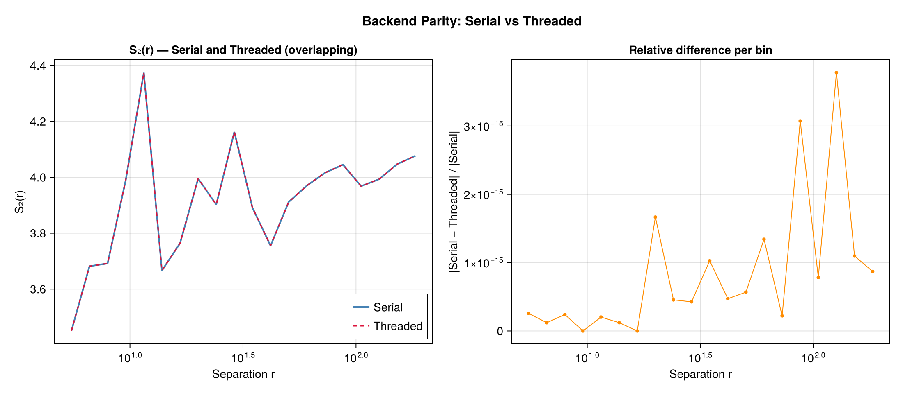
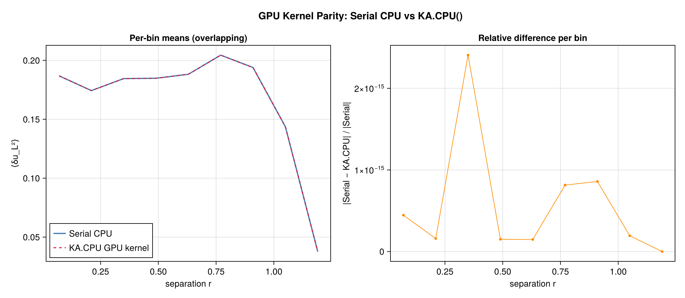
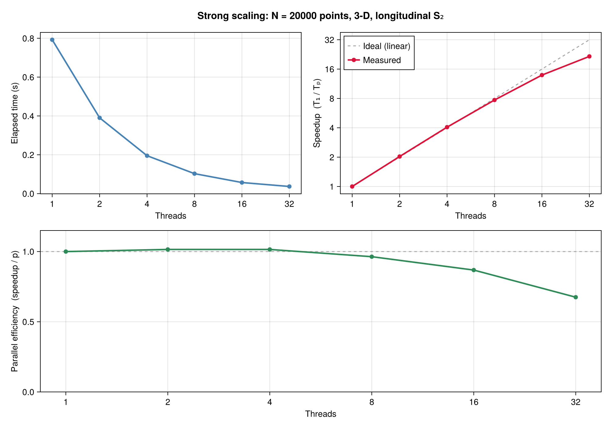
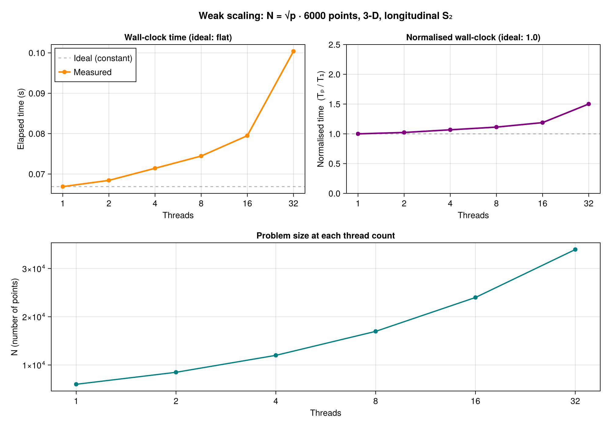

# Execution backends and workspaces

Execution backends select hardware and parallel execution. Spectral backends select a numerical method. Both choices must support the requested operator, geometry, and data layout.

## Execution choices

| Backend | Required package | Execution |
|---|---|---|
| `SerialBackend()` | Core dependencies | One CPU thread |
| `ThreadedBackend()` | `OhMyThreads` | Tasks with private partial reductions |
| `DistributedBackend()` | `Distributed` | Julia worker processes |
| `MPIBackend()` | `MPI` | MPI ranks |
| `GPUBackend(device)` | `KernelAbstractions`, device provider | Device kernels |
| `AutoBackend()` | Available extensions | An available execution method |

Import these types from `ComputationalBackends`. Load `CUDA` and use `GPUBackend(CUDA.CUDABackend())` for CUDA. `GPUBackend(KernelAbstractions.CPU())` runs the portable device kernels on the CPU.

## Explicit CPU calculation

```@example backends
using Random: Random
using ComputationalBackends: SerialBackend
using StructureFunctions: Calculations as SFC, StructureFunctionTypes as SFT
rng = Random.MersenneTwister(7)
x = Random.rand(rng, 2, 32)
u = Random.randn(rng, 2, 32)
bins = range(0.0, 1.5; length=9)
s = SFC.calculate_structure_function(SFT.L2SFType(), x, u, bins;
    backend=SerialBackend())
s.values
```

For threading, start Julia with the allocated thread count, load `OhMyThreads`, and select `ThreadedBackend()`. Distributed and MPI workers must use a compatible project and package resolution. Configure the local backend and worker threads within the allocated CPU budget.

## Agreement between backends

Every backend sums the same pairs into the same bins. Counts agree exactly; sums agree to the rounding of a different
summation order.





## Thread scaling

The threaded point kernel on one physical core per thread, for a fixed problem (strong scaling) and for a problem
whose pair count grows with the threads (weak scaling). `benchmark/benchmark_scaling.jl` regenerates both figures;
the [GPU page](gpu.md) has the device's.





## Result location

A result computed on a GPU backend stays on the device; `to_host(result)` copies it to host memory. A device call
returns once its work is queued, as a CUDA.jl array operation does; reading the result waits for it. In-place calls
on a GPU backend take output buffers on the device and add to them.

## Repeated calculations

`CPUSFWorkspace` and `GPUSFWorkspace` retain buffers for compatible calculations. Construct a workspace for the calculation's layout, bins, precision, and backend; pass it with `workspace=...`. A workspace serves one call at a time. On a grid, a `TransformWorkspace()` keeps the transform's spectra, plans and scratch from one call to the next, as a time series on one grid makes; it takes no arguments and rebuilds what it keeps when a call's sizes change.

Mutating entries add to output buffers; zero them when starting an independent result. A workspace carries no result from one call to the next: allocating entries return fresh buffers. Integer counts must represent both existing counts and the new contributions. Weighted normalization uses floating-point pair mass.

Workspace compatibility and supported families are specified in the [calculation reference](api/calculations.md).

## Numerical methods

Direct pairs support general pairwise operators. Culling restricts enumeration using an exact geometric cutoff. Sorted-line polynomial moments and gridded FFT correlations exploit additional structure. Explicit nonuniform and harmonic methods have their own resolution and tolerance parameters.

Use `SpectralBackends` method tags where the interface accepts them. An FFT requires a compatible provider and a polynomial operator. The non-uniform FFT and harmonic methods bin softly, at the resolution of their mode count or degree.

