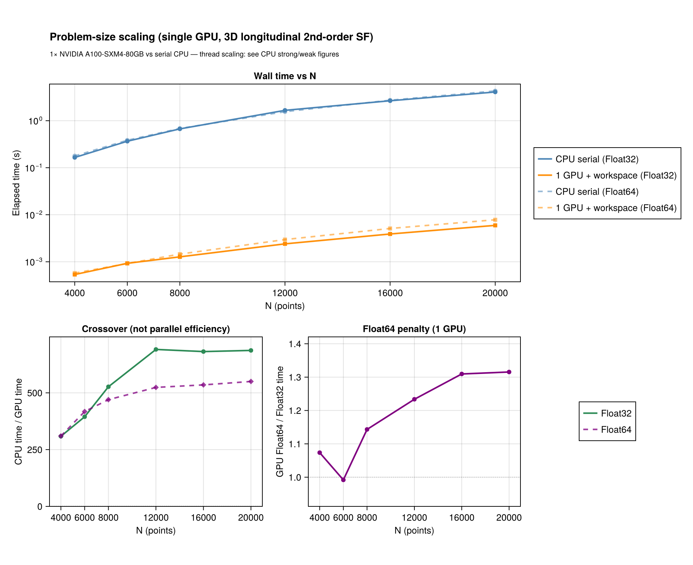
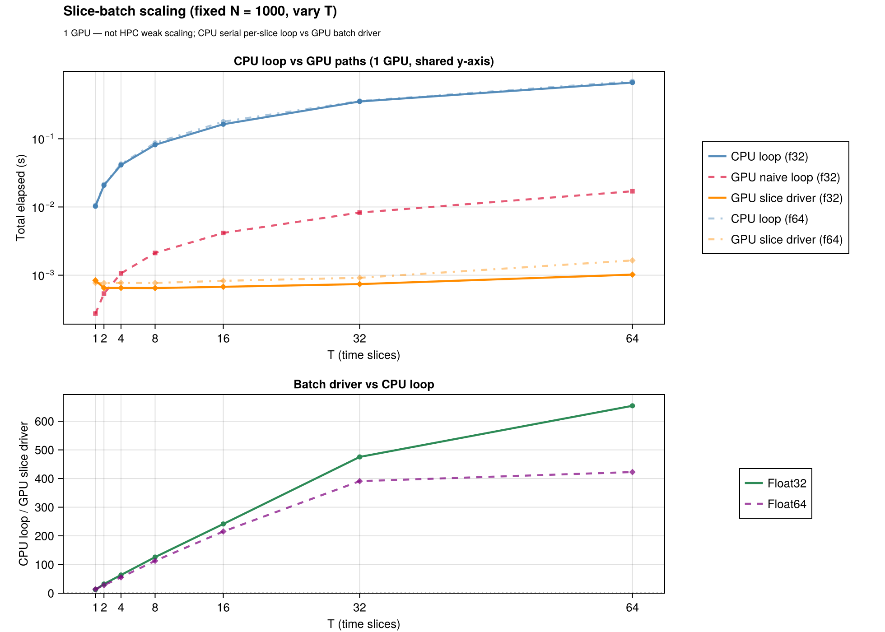

# GPU acceleration

The device kernels live in the `StructureFunctionsKernelAbstractionsExt` extension (loaded with
`using KernelAbstractions`). `using CUDA` adds native CUDA kernels for the point, joint and
single-pass routes and their batches: each call takes the launch plan measured fastest for its element
types, coordinate width, bin count and size, and a call large enough for it to pay first samples the
share of its pairs in range, which picks among plans measured fastest at different shares. Every
device route is also run on `KernelAbstractions.CPU()`, which executes the same kernel source on the
host and is how the default test suite covers the kernels without a device. CUDA is the tested
hardware.

For backend selection across serial / threaded / distributed / GPU see [Backends](backends.md); the
CUDA validation and benchmark scripts are in the repository's
[`gpu/`](https://github.com/jbphyswx/StructureFunctions.jl/tree/main/gpu) directory.

Every code block on this page needs a CUDA device, so the documentation build shows them without
running them; the pages that do not need one have their blocks executed on every build. The same
calls run on `KernelAbstractions.CPU()` by swapping the device, which is what the test suite does.

## When to use the GPU

- **Problem size.** Pair histograms pay off above a crossover size that depends on the hardware;
  below it the threaded CPU backend is faster.
- **Memory.** Device arrays use the layout `(D, N)` or `(D, N, T)` for batches. `Float32` is faster on
  the device; `Float64` is supported and is what the parity tests compare.
- **Not a drop-in speedup on the CPU.** Without a GPU, `KA.CPU()` runs the same kernels on the host
  and is slower than `ThreadedBackend()`.

## Point lists

```julia
using StructureFunctions: Calculations as SFC, StructureFunctionTypes as SFT
using ComputationalBackends: ComputationalBackends as CB
using KernelAbstractions, CUDA

x = CUDA.CuArray{Float32}(rand(Float32, 3, 20_000))
u = CUDA.CuArray{Float32}(rand(Float32, 3, 20_000))
bins = collect(Float32, range(0.0f0, 1.5f0; length = 21))

res = SFC.calculate_structure_function(SFT.L2SFType(), x, u, bins; backend = CB.GPUBackend(CUDA.CUDABackend()))
```

`bins` must have the element type of `x` and `u`; the device API casts nothing silently.
The joint value-binned histogram (`value_bins`), the six single-pass invariants and the batches over
auxiliary axes take the same `backend` keyword.

### `GPUSFWorkspace` — reuse what a call prepares

Repeated calls with one bin layout pass a workspace to the public entry alongside the GPU backend. It
keeps what a call prepares from its bins and points — the device digitizers, the staged inputs, and the
cull grid with its tile-pair lists — so a repeated call on the same points pays only for its fields:

```julia
ws = SFC.GPUSFWorkspace(CUDA.CUDABackend(), bins)
for _ in 1:10
    SFC.calculate_structure_function(SFT.L2SFType(), x, u, bins;
                                     backend = CB.GPUBackend(CUDA.CUDABackend()), workspace = ws)
end
SFC.release!(ws)
```

`calculate_structure_functions_single_pass` and `calculate_structure_functions_single_pass_2d` take a
workspace built with `kind = :single_pass` or `kind = :single_pass_2d` the same way.

Every device point route culls: the points are sorted into cells on the device and only the tile pairs
that can hold a pair within the largest finite bin edge are swept. `AlwaysCulling()` prepares the cells on
every call; `AutoCulling()` prepares them when a workspace keeps them for later calls, and otherwise only
for a call whose pairs are numerous enough to repay the sort. Call `refresh!(ws)` after changing
coordinates in place.

### Time series — the batch drivers

For `T` snapshots stack the data as `(D, N, T)`, upload once and call the batch driver, which keeps the
batch on the device:

```julia
N, T = 20_000, 16
x_batch = CUDA.CuArray(rand(Float32, 3, N, T))
u_batch = CUDA.CuArray(rand(Float32, 3, N, T))
sums = CUDA.zeros(Float32, length(bins) - 1, T)
counts = CUDA.zeros(UInt32, length(bins) - 1, T)
SFC.calculate_structure_function_batch!(sums, counts, SFT.L2SFType(), x_batch, u_batch, bins;
                                        backend = CB.GPUBackend(CUDA.CUDABackend()))
```

The output buffers of a device call are device arrays, filled in the order of the task's device stream: a
call returns once its work is queued, as a device array operation does. `Array(sums)` waits for it and
copies one to the host, and `StructureFunctions.to_host(res)` a result; time a call with `CUDA.@sync`.

The batch entries — `calculate_structure_function_batch!`, `calculate_structure_function_2d_batch!`,
`calculate_structure_functions_single_pass_batch!`, `calculate_structure_functions_single_pass_2d_batch!` —
dispatch on the backend; the CPU backends run them too.

A field sampled repeatedly on a grid takes the same entry with the grid in place of the coordinates,
`(component, cells..., T)` in and `(n_distance, T)` out; with the `grid` and `gbins` of the grid
section below:

```julia
ug_batch = randn(Float32, 2, 64, 64, T)
gsums = CUDA.zeros(Float32, length(gbins) - 1, T)
gcounts = CUDA.zeros(UInt64, length(gbins) - 1, T)
SFC.calculate_structure_function_batch!(gsums, gcounts, SFT.L2SFType(), grid, ug_batch, gbins;
                                        backend = CB.GPUBackend(CUDA.CUDABackend()))
```

Each pair's separation, distance bin, reading and geodesic frame belong to the grid, not to the
field, so the batch computes them once and contracts every slice against them. In the transform's
binning kernel one work item owns one `(lag, slab pair)` and loops the slices inside.

### Route table for point lists

| call | shapes | `D` | bins | device route |
|---|---|---|---|---|
| `calculate_structure_function(sf, x, u, bins; backend)` | `(D, N)` | any | linear, log, general | tiled pair blocks with a block-local histogram; above the shared-memory budget, global atomics |
| points on a line, a polynomial `sf` (also over `fields`) | `x::(1, N)` | 1 | linear, log, general | the sorted line: a device sort, prefix sums of the centred field's monomials, each point's partners in a bin as one index range |
| shared positions | `x::(D, N)`, `u::(D, N, aux...)` | any | linear for the fused route | fixed-position batch kernels |
| varying positions | `x, u::(D, N, aux...)` | any | linear for the fused route | varying-position batch kernels |
| `calculate_structure_function(sf, x, u, bins, value_bins; backend)` | `(D, N)` or batches | any | typed or vector value bins | shared-memory joint histogram when it fits, global atomics otherwise |
| `calculate_structure_functions_single_pass(x, u, bins; backend)` | `(D, N)` or batches | any | linear, log, general | tiled six-row histogram |
| `calculate_structure_functions_single_pass_2d(x, u, bins, value_bins; backend)` | `(D, N)` or batches | any | typed or vector value bins | the whole histogram or one set of invariant planes per pass on chip when it fits, global atomics otherwise, chosen per call |
| `calculate_structure_function_tensor(order, x, u, bins; backend)` | `(D, N)` or batches | any | any | the 1-D tiled kernels over the tensor's packed symmetric components, any order |
| `calculate_structure_function_tensor(order, x, u, bins, angle_bins; second_axis, backend)` | `(D, N)` | any, flat | any | the joint tiled kernels over the packed components, binned by separation angle |
| `calculate_structure_function(sf, x, fields, bins; backend)` | `(D, N)` | any | any | the 1-D tiled kernels over the packed multi-field column |

`D = size(u, 1)` is the velocity width and `N = size(x, 2) = size(u, 2)`; trailing axes are
independent auxiliary calculations. Widths 2 and 3 are compiled ahead of time; any other width is
one more kernel instantiation, compiled the first time it is launched. Where a width's staged tiles
exceed a kernel's shared-memory budget the route takes its global-atomic sibling, which stages
nothing.

## Grids: the transform engine on a device

The gridded transform takes the hardware from the same `backend` keyword. With `using FFTW: FFTW` (or
another `AbstractFFTs` implementation) and `using KernelAbstractions: KernelAbstractions`, a
`GPUBackend` moves the masked, weighted monomials to the device, takes their transforms there through
the device's own `AbstractFFTs` implementation, forms every inverse column of a batch of slab pairs in
one kernel, and bins every lag of every slab pair in a second kernel with a privatized histogram.
Uniform, stretched and lat-lon grids, masks, weights, multi-fields, every polynomial order, the
joint histogram over angle, slice batches, the rank-`P` moment tensor, the six single-pass invariants
(`calculate_structure_functions_single_pass(grid, u, bins)`) and the soft-binned non-uniform FFT route
run through it; the counts are exactly the CPU engine's.

```julia
using FFTW: FFTW
using FlowGeometries: FlowGeometries as FG
using SpectralBackends: SpectralBackends as SB

geo = FG.Geometry.CartesianGeometry()
grid = FG.Grids.StructuredGrid(geo, range(0.0, step = 0.1, length = 64),
                               range(0.0, step = 0.1, length = 64))
ug = randn(Float32, 2, 64, 64)
gbins = collect(Float32, range(0.0f0, 3.0f0; length = 31))
sf = SFC.calculate_structure_function(SFT.L3SFType(), grid, ug, gbins,
                                      SB.FastFourierTransformSpectralBackend(), UInt64;
                                      backend = CB.GPUBackend(CUDA.CUDABackend()))
```

`AutoSpectralBackend()` on a device takes the transform wherever the transform can express the
operator. The direct lag sweep has a device kernel of its own, `Calculations.device_lag_sweep!`: the
route a non-polynomial operator takes on a grid, since the transform computes polynomial moments and
cannot express one, and the only route of the joint histogram by value, which bins each pair's own
value where a transform has only each lag's sum. It runs the distance histogram, both joint
histograms, the single-pass invariants and slice batches: each slice, slab pair and lag gets lanes that
sweep its cells side by side, more when there are fewer lags to fill the device and when the lag is
longer.

A schedule with many slabs transforms many short monomials, so the *number* of operations rather than
their size sets the cost. The monomials are built and transformed in blocks — every monomial of as
many slabs as the batch budget admits, or one large slab's monomials in groups — each block in one
broadcast and one batched transform, and the spectra are laid out in the order the spectral kernel
reads them, so assembling its input is a reshape rather than a copy per spectrum.

The binning kernel launches each slab pair over the lags that pair can reach, the same box the host
loop takes. On a lat-lon grid a parallel spans less distance the nearer it lies to a pole, so the box
over all row pairs stays as wide as the equator's however small the largest bin edge is; a schedule
that reports `uniform_lag_box` instead shares one box across every pair and is indexed by division.

## Single-type joint 2D shared memory

A portable device kernel keeps its histogram in shared memory when the bytes its shared arrays take,
for the call's element types, fit the device's static shared-memory budget, and accumulates with
global atomics otherwise. The budget is the device's own (`gpu_device_caps`), so the same call can
take a different kernel on a device with less shared memory; the answer is the same either way.

[`GPUSFWorkspace`](@ref StructureFunctions.Calculations.GPUSFWorkspace) for `kind = :joint2d` defaults to the exact compile-time shared histogram
width `n_dist × n_val`; `joint2d_compile_cells = joint2d_smem_align256(n_dist, n_val)`, or the widest
width a device fits, `joint2d_smem_max(backend, W, F, XT, OT, CT)` for `W`-wide coordinates and
`F`-wide fields, overrides it so bin grids of different shapes share one compiled kernel.

## Six-invariant single-pass 2D

Where no native kernel takes the call, the device path for `calculate_structure_functions_single_pass_2d!`
keeps the histogram on chip — whole (`:shared`) or one set of invariant planes per pair pass (`:typeplane`) —
when the device's static shared-memory budget holds it for the call's element types, and accumulates in
global memory otherwise. The six rows are `S2`, `L2`, `T2`, `S3`, `L3`, `L1T2`; the basis-dependent
`T3` and `L2T1` are not part of the single-pass contract and take the general entries with their
transverse convention.

## Testing tiers

| tier | command | what it proves |
|---|---|---|
| default suite | `julia --project=test test/runtests.jl` | kernel arithmetic, binning, workspaces and slices on `KA.CPU()`, the same kernel source without CUDA |
| CUDA | `julia --project=gpu gpu/runtests.jl` | every CUDA suite: point kernels, workspaces, 1-D and 2-D parity, end-to-end 2-D, slices, the gridded engine's parity table, and every tiled kernel's static shared memory against the bytes its launcher decides by (skipped when `!CUDA.functional()`) |
| gridded parity table | `gpu/run_cuda_gridded_parity.sh` | counts exact and sums to round-off against the CPU on every schedule, the non-uniform FFT route and the tensor kernel |
| benchmarks | `julia --project=gpu gpu/benchmark_suite.jl` | release-performance gates and timing JSON |

`KA.CPU()` does not prove CUDA correctness, and that is why the CUDA tier exists. It compiles no
kernels, so a construct that a device compiler rejects — a runtime-length tuple, a boxed capture, a
runtime-value branch, an `@index` inside a branch, a formatted throw message — passes there and fails
only on a device; and it runs none of the CUDA-specific launch routes, so a defect confined to one of
those is invisible to it.

## Benchmarks and figures

The figures below show problem-size scaling — one device against the serial CPU, sweeping
`N`, and one device sweeping the slice count `T` — not strong or weak scaling. They are regenerated on a
CUDA device with `gpu/collect_benchmark_assets.jl` followed by
`docs/generate_assets/generate_gpu_figures.jl`; the parity figure (`KA.CPU()` against serial) with
`docs/generate_assets/generate_assets.jl`. CPU thread scaling is in `benchmark/benchmark_scaling.jl`.





## Examples

- [`examples/gpu_acceleration.jl`](https://github.com/jbphyswx/StructureFunctions.jl/blob/main/examples/gpu_acceleration.jl) — a single snapshot with a workspace
- [`examples/gpu_time_slices.jl`](https://github.com/jbphyswx/StructureFunctions.jl/blob/main/examples/gpu_time_slices.jl) — the slice batch against a naive loop
