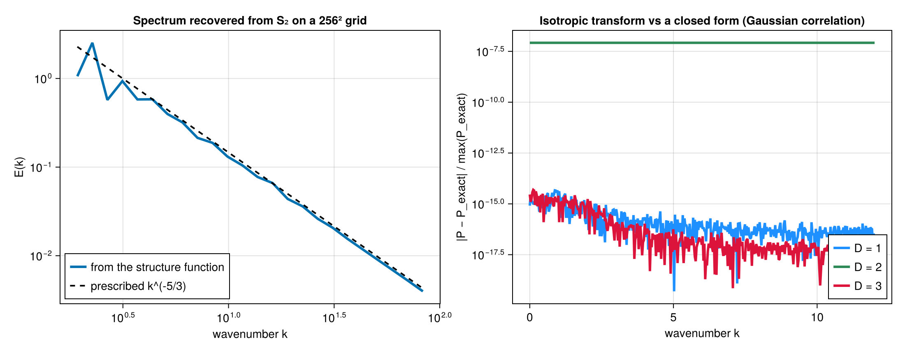
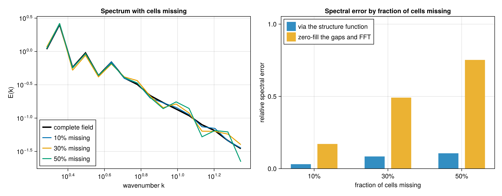
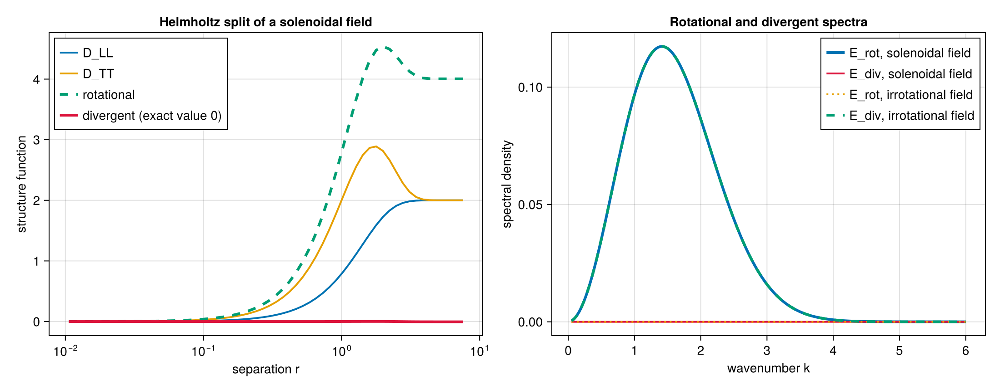
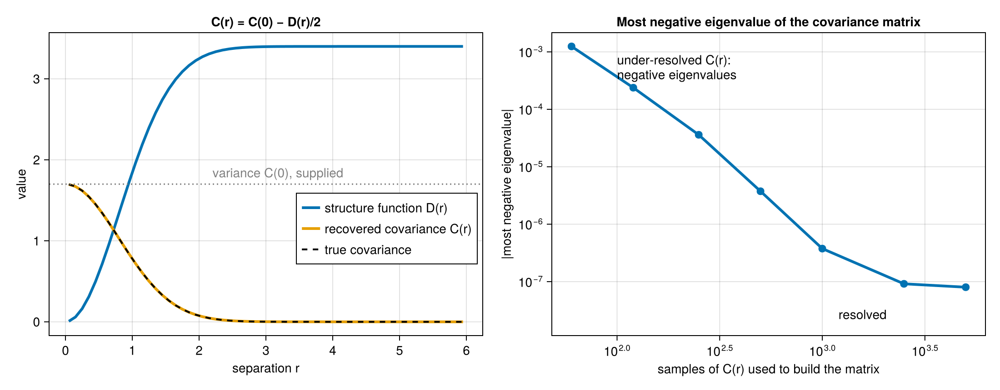
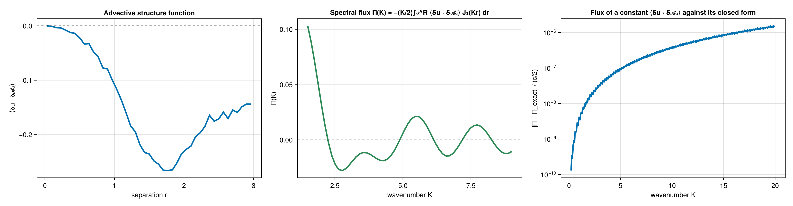
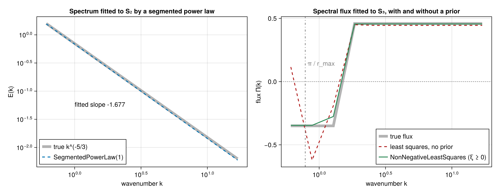

# Spectra, fluxes, and fitting

A transform of a structure function assumes a relationship between the sampled statistic and the target spectrum or
flux: the dimension, isotropy, the separations covered and the normalization all enter it. Each function below states
its assumptions in its reference entry.

## Spectra

`isotropic_spectrum(result, k, Val(D); variance)` transforms the second-order trace `S2SF` into the spectral density
of an isotropic field in `D = 1, 2, 3` dimensions, normalized so that `shell_spectrum` integrates over `k` to the
variance. `variance` is the field's variance, summed over the components of a vector field: twice it is the limit the
structure function approaches at large separation, which the transform subtracts before the integral stops at the
last separation. The integral runs from zero separation, where the structure function vanishes, by the trapezoid
rule. The two-dimensional kernel needs `Bessels`.

```@example spectra
using StructureFunctions: Calculations as SFC, StructureFunctionTypes as SFT
σ2, ℓ = 1.7, 0.8
r = collect(range(0.0, 16.0; length = 4000))
s2 = @. 2σ2 * (1 - exp(-r^2 / (2ℓ^2)))          # S₂ of a Gaussian correlation
k = collect(range(0.1, 6.0; length = 60))
P = SFC.isotropic_spectrum(SFT.S2SFType(), r, s2, k, Val(3); variance = σ2)
exact = @. σ2 * ℓ^3 * exp(-k^2 * ℓ^2 / 2) / (2π)^(3 / 2)
maximum(abs, P .- exact) / maximum(exact)
```

On a grid, `gridded_spectrum(u, schedule, Val(D), tag)` gives the spectrum through the lag-space correlation of the
grid's own pairs, and `shell_average` reduces it to shells in `|k|`. With cells missing it is an estimate from the
pairs that remain.





## The Helmholtz split

In two dimensions the longitudinal and transverse second-order functions separate the rotational and divergent
parts of the field: `D_rot = D_TT + I` and `D_div = D_LL − I`, with `I(r) = ∫₀^r (D_TT − D_LL)/s ds`.
`helmholtz_decompose_2d` evaluates the integral from zero separation by the trapezoid rule over the bin midpoints; the
single-pass calculation returns it for point fields. `helmholtz_spectra(L2, T2, k; variance)` and
`helmholtz_spectra(h, k; variance)` transform both parts to spectra: the trace by `J₀` with the field's variance, and
`D_LL − D_TT`, which decays on its own, by `J₂`.



## Covariance

For a second-order stationary field `C(r) = C(0) − D(r)/2`. `covariance(result, variance)` returns `C(r)` given the
variance, which the structure function does not contain. `covariance_matrix(points, separations, C)` evaluates the
covariance at every pair of points and checks the matrix for positive semi-definiteness; a covariance function
sampled too coarsely fails the check.



## Spectral fluxes

`spectral_flux(result, K)` evaluates the scale-to-scale flux from the advective structure function
`⟨δu · δ𝓐ᵤ⟩` (`VectorDotSFType(1, 2)` on `Fields(vectors = (u, 𝓐u))`) through
`Π(K) = −(K/2)∫₀^R ⟨δu · δ𝓐ᵤ⟩ J₁(Kr) dr`, and from the third-order functions `S3SFType`, `L3SFType` and
`MixedSFType{1,0,2}` with the boundary term each relation leaves at the last separation. `enstrophy_flux` gives the
enstrophy flux of a two-dimensional flow from the same advective structure function. The integrals run from zero
separation by the trapezoid rule and need `Bessels`.



## Fitting

A fit compares the measured structure function with a forward model of a spectrum or a flux on chosen wavenumber
bins:

- `SpectrumForwardModel` maps a shell spectrum to `S2`, `HelmholtzForwardModel` the gradient and curl spectra to
  `D_LL` and `D_TT`, and `FluxForwardModel` a piecewise-constant flux to `S3`.
- `fit_spectrum`, `fit_helmholtz_spectra` and `fit_flux` build the model and solve it with
  `RegularizedLeastSquares(prior)` (with a data covariance `W`, returning the posterior covariance),
  `NonNegativeLeastSquares()`, or a `SegmentedPowerLaw` (with `LsqFit`).
- `tradeoff_curve` reports the residual and the solution norm across prior strengths; `select_segments` picks the
  segment count with the smallest residual.
- `independent_pair_variance(joint)` estimates the variance of each bin's mean from a value-binned joint histogram
  with integer counts, assuming independent pairs. Pairs sharing a point are correlated, which it does not account
  for, and the spread inside a value cell is unseen, so the result is a lower bound.
- A result with batch axes is fitted slice by slice; `W` is one covariance for all slices or a `SliceCovariances`.



[Validation](validation.md) lists the analytic checks behind each of these functions.
