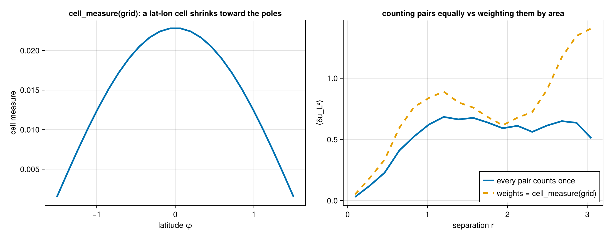
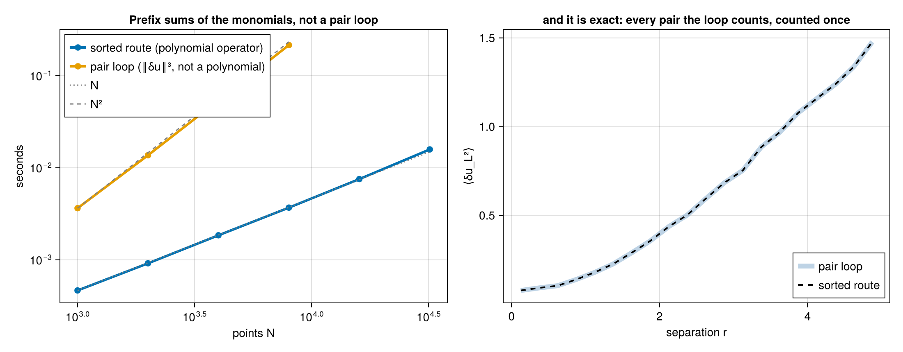
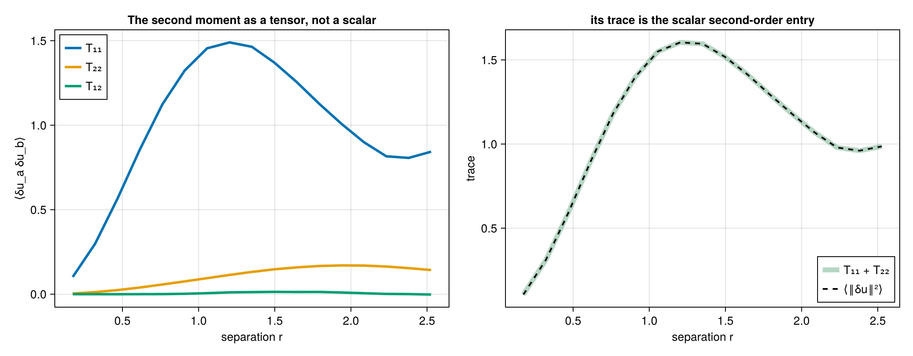
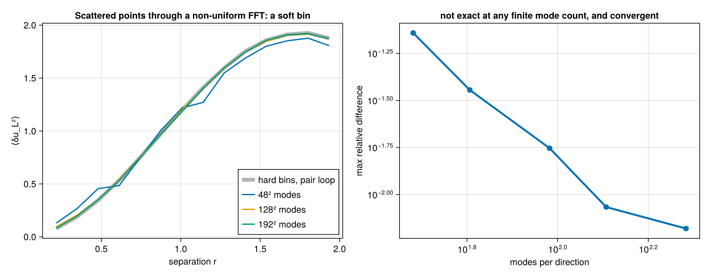
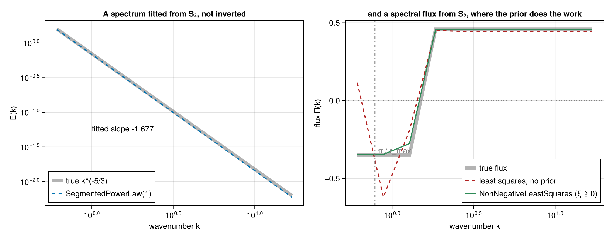

# Walkthrough: from a velocity field to a cascade diagnostic

This page runs one analysis end to end: six structure-function invariants, the Helmholtz split, the
directional signal and the spectral slope. The fields are ones whose answers are known in advance,
so every number below can be compared against a value derived independently.

Two acts, because the two data layouts take different algorithms. Scattered points go through the
pair loop; a uniform grid goes through the transform, which is exact and about two orders of
magnitude faster.

## Act 1 — scattered points

A superposition of Fourier modes whose polarisations are perpendicular to their wavevectors is
divergence-free by construction, so we know its divergent part is zero before computing anything.

```julia
using StructureFunctions: StructureFunctions as SF, Calculations as SFC,
    StructureFunctionTypes as SFT
using ComputationalBackends: ComputationalBackends as CB
using StaticArrays: StaticArrays as SA
using Random

function solenoidal_field(x; kmin = 3, kmax = 40, seed = 42)
    rng = Random.MersenneTwister(seed)
    N = size(x, 2)
    u = zeros(2, N)
    for a in -kmax:kmax, b in -kmax:kmax
        k = sqrt(a^2 + b^2)
        (kmin <= k <= kmax && a > 0) || continue
        amp = k^(-4 / 3)                      # gives an E(k) ~ k^(-5/3) shell energy
        φ = 2π * rand(rng)
        ex, ey = -b / k, a / k                # perpendicular to k, hence divergence-free
        for p in 1:N
            c = amp * cos(a * x[1, p] + b * x[2, p] + φ)
            u[1, p] += c * ex
            u[2, p] += c * ey
        end
    end
    return u
end

Random.seed!(9)
x = 2π .* rand(2, 6000)
u = solenoidal_field(x)
```

A point list carries no mask. A non-finite sample makes every bin it pairs into `NaN`, as any sum
does, so drop such points before the call: `keep = vec(all(isfinite, u; dims = 1))`, then
`x[:, keep]` and `u[:, keep]`. Grids are different, because their lags and transforms need every cell
in place; there the mask travels with the data (Act 2).

### Six invariants in one pass

The six second- and third-order invariants share a pair loop, a separation and a bin, so computing
them together costs one pass rather than six.

```julia
bins = collect(10 .^ range(log10(0.05), log10(2.0); length = 25))
res = SFC.calculate_structure_functions_single_pass(x, u, bins; backend = CB.SerialBackend())

keys(res)
# (:S2, :L2, :T2, :S3, :L3, :L1T2, :helmholtz)
```

That is 18.0 million pairs. Culling is on by default, so pairs beyond the last bin edge are never
enumerated.

### The Helmholtz split

The rotational and divergent parts of the second-order structure function come from the
longitudinal and transverse components, and arrive with the single pass.

```julia
h = res.helmholtz
D_rot = h.rotational_sums ./ max.(h.rotational_counts, 1)
D_div = h.divergent_sums ./ max.(h.divergent_counts, 1)

occ = isfinite.(res.L2.values) .& (h.rotational_counts .> 0)
maximum(abs, D_div[occ]) / maximum(res.L2.values[occ])   # 0.1195
maximum(abs, (D_rot .+ D_div .- (res.L2.values .+ res.T2.values))[occ])   # 2.2e-16
```

The field is solenoidal, so the true divergent part is zero and the residual `0.1195` is the
decomposition's own quadrature floor. It comes from the integral's lower limit: the cumulative
integral starts at the first bin's abscissa rather than at zero, and the omitted segment carries
real weight when the integrand rises at small separation. Narrowing the first bin shrinks it —
running the same field over `log10(0.05)` to `log10(2.0)` with a band of `kmin = 4, kmax = 20`
instead gives `0.0317`.

The energy identity `D_rot + D_div = D_LL + D_TT` holds to `2.2e-16`. Note that this identity is
**not** a check on the split: it is preserved by a whole family of errors in it, including a
factor-of-`r` defect this package once carried. See [Validation](validation.md).

### Directional output

The second histogram axis can bin the angle between the separation and a reference direction
instead of the operator's value, which turns `S(r)` into `S(r, θ)` without touching the kernel.

```julia
ua = zeros(2, size(x, 2))
ua[1, :] .= sin.(6 .* x[1, :])          # varies along x only

ang = collect(range(0, π; length = 5))
dj = collect(range(0.0, 1.2; length = 6))
j = SFC.serial_calculate_structure_function(
    SFT.L2SFType(), x, ua, dj, ang;
    second_axis = SFC.SeparationAngleAxis(SA.SVector(1.0, 0.0)),
    verbose = false, show_progress = false)
```

Averaged over separation, the four angular bins give

| θ | ⟨δu_L²⟩ |
|---|---|
| [0, π/4) | 0.806 |
| [π/4, π/2) | 0.250 |
| [π/2, 3π/4) | 0.252 |
| [3π/4, π) | 0.801 |

a 3.2× anisotropy, in the right sense: the field varies only along `x`, so separations aligned with
`x` see the full increment. The perpendicular bin is not zero because it spans 45°–90°, and only
*exactly* perpendicular separations have an identically zero increment.

The angle folds to `[0, π)` because swapping a pair's ends flips both the separation and the
increment, and no structure function distinguishes the two.

### The exact laws

The inertial-range laws are inversions of a measured moment. Each takes the specific moment it is
stated for, and they are not interchangeable:

```julia
r = collect(range(0.2, 3.0; length = 8))
SF.KHM.epsilon_from_four_fifths(r, -(4 / 5) * 0.85 .* r)[1]    # 0.850000
```

Applied to this field, though, the answer is that there is nothing to recover: a synthetic Gaussian
field has no energy cascade, so its third-order moments are consistent with zero
(`⟨δu_L³⟩ = 1.3e-2` against `⟨δu_L²⟩ ≈ 1`, i.e. sampling noise). A meaningful `ε` needs data with a
genuine flux — a forced simulation or an observational record.

### Pair weights

A weight per point turns every statistic into `Σ w_i w_j v_ij / Σ w_i w_j` and the counts into a
weighted pair mass, which is why weighted results take floating-point counts:

```julia
w = 0.5 .+ rand(size(x, 2))
sfw = SFC.calculate_structure_function(SFT.L2SFType(), x, u, bins, Float64; weights = w,
                                       backend = CB.SerialBackend())
```

Weights of one reproduce the unweighted result bit for bit. On a grid, `cell_measure(grid)` gives the
cell areas, so a lat-lon sum becomes an area average — the same weighting the harmonic route uses.



*A lat-lon cell shrinks toward the poles, so weighting the pairs by `cell_measure(grid)` moves the
average away from the one that counts every pair once.*

### Points on a line

One-dimensional data — a transect, a time series read as a line — never needs the pair loop. Once the
points are sorted, every bin of every point is one index range, and the polynomial moments over a
range are prefix-sum differences of the monomials. The CPU backends take this route automatically
for every polynomial operator, arrays and multi-fields alike, and its cost is
`O(N log N + N n_bins)`:

```julia
xl = reshape(sort(rand(100_000)) .* 100.0, 1, :)
ul = randn(1, 100_000)
sfl = SFC.calculate_structure_function(SFT.L3SFType(), xl, ul, collect(range(0.0, 0.5; length = 21)), Int64)
```

On eight cores a million points — five billion pairs binned — take `0.4 s`; the pair loop on the same
data would take an hour. Counts are bit for bit the pair loop's, because the route bins each pair with
the same `digitize` call on the same coordinate difference.



*Left: the sorted route's cost grows with the points, the pair loop's with their square. Right: it is
the pair loop's answer, not an approximation of it.*

## Act 2 — a uniform grid

On a grid the same quantity is available by transform, exactly, for every lag at once.

```julia
using SpectralBackends: SpectralBackends as SB
using FFTW: FFTW

function spectral_field(n; kmin, kmax, seed = 5)
    rng = Random.MersenneTwister(seed)
    Fx = zeros(ComplexF64, n ÷ 2 + 1, n)
    Fy = zeros(ComplexF64, n ÷ 2 + 1, n)
    for ix in 1:(n ÷ 2 + 1), iy in 1:n
        kx = ix - 1
        ky = iy - 1 <= n ÷ 2 ? iy - 1 : iy - 1 - n
        k = sqrt(kx^2 + ky^2)
        (kmin <= k <= kmax) || continue
        amp = k^(-4 / 3) * n^2
        ph = exp(im * 2π * rand(rng))
        Fx[ix, iy] = amp * ph * (-ky / k)     # perpendicular to k, so k·û = 0
        Fy[ix, iy] = amp * ph * (kx / k)
    end
    u = zeros(2, n, n)
    u[1, :, :] .= FFTW.irfft(Fx, n)
    u[2, :, :] .= FFTW.irfft(Fy, n)
    return u
end

n = 256
dx = 2π / n
u = spectral_field(n; kmin = 2, kmax = 100)

bins = collect(10 .^ range(log10(1.5 * dx), log10(2.6); length = 33))
plan = SFC.squared_digitize_plan(bins)
sums = zeros(Float64, SFC.n_histogram_bins(plan))
counts = zeros(Int, length(sums))
sched = SFC.UniformLagSchedule((n, n), (dx, dx), (true, true))

SFC.gridded_sweep!(sums, counts, SFT.L2SFType(), u, sched, bins, Val(2),
                   SB.FastFourierTransformSpectralBackend())
```

This bins **1.154 billion pairs**. On eight dedicated cores the transform takes `0.014 s`; the
direct lag sweep over the identical configuration takes `1.767 s`, a factor of 126, and the two
agree to round-off. Passing `SB.AutoSpectralBackend()` costs both and picks the cheaper one, which
is not always the transform — at small cutoffs the sweep wins.

### The spectral slope

```julia
mids = SF.midpoints(bins)
D = sums ./ max.(counts, 1)
slope(i) = (log(D[i+1]) - log(D[i-1])) / (log(mids[i+1]) - log(mids[i-1]))
```

| r | D_LL | local slope |
|---|---|---|
| 0.088 | 0.882 | 1.02 |
| 0.130 | 1.241 | 1.05 |
| 0.195 | 1.766 | 0.72 |
| 0.222 | 1.941 | 0.74 |
| 0.254 | 2.149 | 0.74 |
| 0.290 | 2.366 | 0.73 |
| 0.331 | 2.610 | 0.71 |
| 0.379 | 2.858 | 0.66 |
| 0.841 | 4.536 | 0.47 |
| 2.134 | 5.778 | 0.01 |

The three limbs are all physical: `r²` below the smallest excited eddy, a plateau near `2/3` across
the excited band, and saturation at `0` beyond the largest. A prescribed `E(k) ~ k^(-5/3)` implies
`D_LL ~ r^(2/3)`, and the measured plateau sits at `0.71 ± 0.03` — the excess is the finite width of
the band, which leaves the plateau squeezed between the two limbs rather than flat.

A scattered-point sample cannot show this at all. Its small-scale end is capped by the mean point
spacing, so a
one-decade band gives a slope that declines monotonically through `2/3` without ever plateauing, and
fitting a single exponent to it returns whatever the fit window happens to select. Resolving a
scaling range needs the dynamic range a grid provides.

### Grids with one uniform direction

A lat-lon grid has no constant lag — a step in longitude is a different distance at every latitude —
but longitude is uniform, so every pair of latitude rows shares its geodesic frame around the whole
circle. The transform runs along longitude for each pair of rows, with the frame applied per lag, and
the same holds for a Cartesian grid with a stretched axis beside a uniform one. Nothing changes at the
call site: the grid's axis **types** decide the route (a range is uniform, a vector of coordinates is
not), the routes are exact, and `verbose = true` names the one chosen.

```julia
using FlowGeometries: FlowGeometries as FG
using ComputationalBackends: ComputationalBackends as CB

n_lon, n_lat = 1440, 720
geo = FG.Geometry.SphericalGeometry(6.371e6)
grid = FG.Grids.StructuredGrid(geo, range(0.0, step = 2π / n_lon, length = n_lon),
                               range(-π / 2 + π / (2n_lat), π / 2 - π / (2n_lat); length = n_lat))
u = randn(2, n_lon, n_lat)                                   # (east, north) at every cell
bins = 6.371e6 .* collect(range(0.0, π; length = 41))       # metres, as the radius is

sf = SFC.calculate_structure_function(SFT.L2SFType(), grid, u, bins, UInt64,
                                     SB.FastFourierTransformSpectralBackend();
                                     backend = CB.ThreadedBackend())
```

Separations come out in the unit of the geometry's radius on every route, the threaded backend
splits the row pairs across tasks, and a field of several fields (`Fields`) rides along, so a
scalar's odd moments and the mixed moments of a Yaglom-type relation come from the same transform.

On eight dedicated cores the transform above bins `5.4 × 10¹¹` pairs in `10.5 s` (`54 s` on one core).
Against the direct row-by-row sweep of the same grid at 180 latitude rows the transform is `62×`
faster for `L2` and `16×` for `L3`, with counts identical and sums agreeing to `10⁻¹⁵`; the gap
narrows at third order because the frame algebra per lag grows with the moment's rank while the
transforms do not.

### The same engine on a device

The transform engine takes the hardware from the same `backend` keyword the point entries use. With
`using KernelAbstractions` and a device package loaded, `backend = CB.GPUBackend(CUDA.CUDABackend())`
moves the masked monomials to the device, takes their transforms there through the device's own
AbstractFFTs implementation, and bins every lag of every slab pair in one kernel with a privatized
histogram. Nothing about the schedule changes: uniform, stretched and lat-lon grids, masks, field
multi-fields and every polynomial order run through the same code, and the counts are exactly the CPU
engine's. `CB.GPUBackend(KernelAbstractions.CPU())` runs the identical kernel on the host, which is
how the suite checks it without a device.

### Tensors

The transform forms the whole increment moment tensor at every lag before contracting it with an
operator, so the tensor itself is available on a grid, at any order, in the pair frame — and jointly
in separation and angle:

```julia
T3 = SFC.calculate_structure_function_tensor(Val(3), grid, u, bins, SB.FastFourierTransformSpectralBackend())
T3.values                                     # (2, 2, 2, n_bins): ⟨δu_a δu_b δu_c⟩ per bin
T2θ = SFC.calculate_structure_function_tensor(Val(2), grid, u, bins, ang, SB.FastFourierTransformSpectralBackend();
                                             second_axis = SFC.SeparationAngleAxis(SA.SVector(1.0, 0.0)))
```

An odd-rank tensor changes sign when a pair is read from its other end, so in a fixed frame it takes
the canonical pair reading, as the odd scalar moments do; in the sphere's geodesic frame the
components are the same from either end and no sign enters. The point-list tensors follow the same
rule on every backend, and `MomentTensorOperator{P}` names the tensor to the transform engine.



*The components carry the anisotropy the trace averages away, and the trace is the scalar
second-order entry.*

### The transverse convention

The signed transverse component that `T3SFType`, `L2T1SFType` and any odd `NT` read is defined by
the operator's basis convention, `ProjectedStructureFunctionType{0, 3}(basis)`. The default
`CanonicalTransverseBasis()` is `n̂ = ẑ × r̂` in two dimensions and the same rule normalised in three,
continued about `x̂` where the separation is along `ẑ`; `ReferenceAxisTransverseBasis(a)` turns about
an axis of the caller's choosing and refuses a pair whose separation is parallel to it. Every rule's
first vector is odd under `r̂ ↦ −r̂`, which is what makes the operator's value the same from either end
of a pair — and every result carries the convention that produced it, `res.operator.basis`. A rule of
your own is a subtype of `AbstractTransverseBasisConvention` with one `transverse_basis(rule, r̂)`
method obeying that contract; every route, the device kernels included, reads the sign through it.

### Scattered points by non-uniform FFT

A scattered point set has no lags, but placed in a padded box it has modes, and the type-1
non-uniform FFT of its masked monomials is exactly the forward transform the gridded engine expects.
The inverse products are then pair sums with a periodic Dirichlet kernel in place of a delta at each
lag: **soft bins** of about one mode cell, sidelobes and all.

```julia
using NonuniformFFTs: NonuniformFFTs                           # or FINUFFT, or both
s = SFC.ScatteredModesSchedule(x, 2.0, (128, 128); taper = GaussianTaper(0.05))   # r_max = 2, 128² modes
soft = SFC.calculate_structure_function(SFT.L2SFType(), s, u, bins, NonuniformFFTsSpectralBackend())
soft.distance                                  # a ModeBinEdges: soft-binned, not pair counts
```

Two libraries serve the route, each named by its own tag with the tolerance asked of its transforms:
`NonuniformFFTsSpectralBackend(tolerance = 1e-12)`, whose kernel half-support follows from the tolerance by
the Kaiser–Bessel aliasing rule (`nufft_half_support`), and `FINUFFTSpectralBackend(tolerance = 1e-12)`,
which runs cuFINUFFT for points on a CUDA device. The two agree to `1e-10`; SpectralBackends' generic
NUFFT tag names no library and is refused.

This route is **not exact** and is selected only by passing the tag. Its statistic converges to the
hard-binned pair sum as the mode count grows; the tests pin it on a lattice, where it is exact, and
measure the convergence off one. The result carries `ModeBinEdges`, and its counts are a
kernel-weighted pair mass. It pays at size: 20 000 points onto 256×192 modes bin in `0.014 s` on
eight cores and `0.008 s` on an A100, independent of the pair count.



*The soft-binned statistic approaches the hard-binned pair sum as the mode count grows, and is not
equal to it at any finite count.*

### The sphere by spherical harmonics

A pair statistic on a sphere has a second exact route that never enumerates pairs or lags. For any
point set, weights and mask, the spherical harmonic **pseudo-coefficients** of the masked field's
monomials give, as an identity, the pair sum with a soft kernel in place of a hard bin:

```
Σ_ij w_i w_j (θ_j − θ_i)^p K_L(γ_ij, β) = Σ_{l ≤ L} (2l+1)/(4π) b_l X_l P_l(cos β),
K_L(γ, β) = (1/16π²) Σ_l (2l+1) b_l P_l(cos γ) P_l(cos β) → (1/8π²) δ(cos γ − cos β).
```

Vectors ride the same identity through their spin-1 quantity `u_θ + i u_φ`, with Wigner `d^l_{ss′}`
kernels for the spin-weighted monomials the operator's polynomial expands into. The "bin" is the node
set: separations, the truncation degree and a taper on the series.

```julia
nodes = HarmonicNodes(32, 64; taper = GaussianTaper(0.02))   # 32 Gauss–Legendre nodes, lmax = 64
res = SFC.calculate_structure_function(SFT.L3SFType(), x, u, nodes, SB.NUFSHTSpectralBackend();
                                      distance_metric = DI.SphericalAngle())
res.values                                                    # the kernel-binned ⟨δu_L³⟩ at the nodes
```

`SB.DirectSumSpectralBackend()` computes the same coefficients by direct summation, `O(N lmax²)`, and
is the reference; `using NUFSHT` supplies the fast transform. On a Gauss–Legendre grid with exact
quadrature weights the pseudo-coefficients are the coefficients, the series of a band-limited field
terminates, and the route returns the continuous rotation-averaged structure function exactly — the
tests hold every polynomial operator through fourth order to `10⁻⁹` against an independent quadrature
over pairs. The same coefficients give the field's `E`/`B` spectra, `SFC.harmonic_spectra`, and a
kernel-binned result inverts to `C_l` through `isotropic_spectrum(res, g, lmax)` by the nodes' own
quadrature weights: on a masked field that ratio of kernel-binned sums to kernel-binned counts follows
the spectrum of the complete field where the pseudo-spectrum of the masked field does not.

## Act 3 — into spectral space

A structure function and a spectrum carry the same second-order information, and the package
converts between them. Which route to use depends on the data, and the difference is not cosmetic.

### From a grid: exact

On a grid the transform runs over the whole lag space, so no direction is averaged over and no
separation is binned.

```julia
using SpectralBackends: SpectralBackends as SB
using FFTW: FFTW

kaxes, density = SFC.gridded_spectrum(u, sched, Val(2),
                                      SB.FastFourierTransformSpectralBackend())

edges = collect(10 .^ range(log10(1.0), log10(100.0); length = 25))
mids, E = SFC.shell_average(kaxes, density, edges)
```

That takes `0.024 s` on the 256² field, and the variance it implies matches the field's own to every
digit printed — `5.63136` either way. The recovered spectrum has the slope it was built with:

| k | E(k) | local slope |
|---|---|---|
| 2.89 | 6.50e-01 | −2.02 |
| 5.13 | 3.40e-01 | −1.84 |
| 9.13 | 1.32e-01 | **−1.65** |
| 16.23 | 6.06e-02 | −1.53 |
| 28.86 | 2.29e-02 | −1.60 |
| 51.33 | 8.87e-03 | **−1.65** |


against the prescribed `k^(-5/3) = k^(-1.667)`. Note this is the *same information* as Act 2's
`D_LL ~ r^0.71`: the two routes are consistent statements about one field, and `ζ` and the spectral
slope are related by `E(k) ~ k^(-(ζ+1))`.

The reason to reach a spectrum through the structure function — rather than just transforming the
field — is **missing data**. With cells absent the field's own transform is meaningless, while the
structure function is still an unbiased average over surviving pairs. Measured against the
complete-field spectrum on a 48² grid:

| cells missing | via the structure function | zero-fill the gaps and FFT |
|---|---|---|
| 10 % | 0.015 | 0.191 |
| 30 % | 0.036 | 0.543 |
| 50 % | **0.041** | **0.769** |


### Bounded directions, tapers and missing lags

A direction that does not wrap has no Fourier basis of its own, so its spectrum is an estimate: the
transform, on a padded lag grid, of the unbiased autocovariance `C(h) = σ² − D(h)/2` that the pair
counts give at every lag `|h| < n`. The same call serves it; `wavenumbers` has the padded length along
a bounded direction, and the density still integrates to the variance of the held cells.

```julia
kaxes, density = SFC.gridded_spectrum(u, sched, Val(2), SB.FastFourierTransformSpectralBackend();
                                      taper = SFC.Bartlett())
```

`taper` weights the lags before the transform: the far lags of a bounded domain are averaged over
few pairs, and `Bartlett()` (linear to zero at the largest lag) or `GaussianTaper(σ)` trades
resolution in wavenumber for a steadier estimate; `NoTaper()` is the default. With cells missing, a
lag that no pair of held cells names has no structure function at all; the default
`missing_lags = SFC.RefuseMissingLags()` throws, naming the lag, and
`missing_lags = SFC.ZeroDeviationAtMissingLags()` takes its covariance as zero instead.

### From scattered points: isotropic, and one assumption

Scattered data has no lag grid, so the transform integrates against a dimension-appropriate kernel —
`cos` on a line, `J₀` on a plane, `sin(x)/x` in a volume — and averages over the directions of the
separation:

```julia
using Bessels: Bessels      # only the 2-D kernel needs it; 1-D and 3-D are elementary

kq = collect(range(1.0, 30.0; length = 200))
P = SFC.isotropic_spectrum(res.S2, kq, Val(2))     # res.S2 is the trace, from Act 1
```

That assumes the pairs behind each bin sample direction uniformly. Scattered points do. A
rectilinear grid does **not** — its separations are biased toward the lattice axes — which is why
gridded data should take the lag-space route above rather than this one.

### Splitting the spectrum

The Helmholtz decomposition from Act 1 transforms the same way, giving the rotational and divergent
kinetic-energy spectra separately — the reason the package carries the decomposition at all:

```julia
spec = SFC.helmholtz_spectra(res.helmholtz, kq)
maximum(abs, spec.divergent) / maximum(abs, spec.rotational)   # 0.0669
```

The Act 1 field is solenoidal by construction, so its divergent spectrum should vanish; 6.7 % of the
rotational is the decomposition's own quadrature floor carried through the transform.

Because `D_rot + D_div = D_LL + D_TT` exactly and the transform is linear, the two spectra sum to the
spectrum of the trace — an identity that holds whatever the field is, and the one the tests assert.


The same split follows directly from the two projections, without the real-space decomposition and
its cumulative integral: the sum `D_LL + D_TT` transforms with `J₀` as the trace does, and the
difference `D_LL − D_TT` with `J₂`, so

```julia
spec = SFC.helmholtz_spectra(res.L2, res.T2, kq)       # (rotational, divergent), by J₀ and J₂
```

carries only the truncation error of the two Hankel integrals. On a sphere the counterpart is a
Legendre inversion: a scalar's or the trace's structure function binned in `R·σ` gives `C_l` by
`SFC.isotropic_spectrum(sf, geometry, lmax)`, and the two projections give the gradient and curl
spectra `C^E_l`, `C^B_l` by `SFC.helmholtz_spectra(L2, T2, geometry, lmax; variance)` — the sum of the
two needs the field's mean square, which no structure function carries, while their difference does
not.

## Act 4 — fitting instead of inverting

The transforms above are the exact relations. On sparse or noisy data — drifters, a short record —
an oscillatory Bessel kernel amplifies the noise and the finite range truncates the integral, and the
estimator of choice in the recent literature is a **fit**: a forward model from values on wavenumber
bins to the structure function at the measured separations, inverted with a stated prior. The
package carries three forward models and three inversions, and holds the models to the transforms:
the flux fitted from a synthetic `S3` is the flux the `J₂` transform recovers from the same `S3`.

```julia
using LsqFit                                              # only the segmented power law needs it
k_edges = exp.(range(log(0.5), log(20.0); length = 13))   # 12 log-spaced wavenumber bins

# the spectral energy flux from S3 = ⟨δu_L‖δu‖²⟩ (Gutierrez-Villanueva et al. 2026): regularised
# least squares needs the data covariance — here the per-bin variance of the mean under independent
# pairs, read from a value-binned joint histogram — and a prior on (ε, ξ₁…ξ₁₂)
vbins = collect(range(-3.0, 3.0; length = 121))
joint = SFC.calculate_structure_function(SFT.S3SFType(), x, u, bins, vbins)   # value-binned joint histogram
W = SFC.independent_pair_variance(joint)
fit = SFC.fit_flux(res.S3, k_edges, SFC.RegularizedLeastSquares(vcat(1e-7, fill(1e-10, 12))); W)
fit.F, fit.ε, fit.ξ                                        # the flux at the bin centres, its large-scale value, the injection density
fit.flux_covariance                                        # G C_xx Gᵀ

# the monotone-flux variant (Balwada et al. 2022): non-negative least squares, no covariance
nn = SFC.fit_flux(res.S3, k_edges, SFC.NonNegativeLeastSquares())

# a segmented power-law spectrum from S2 (Bhattacharjee et al. 2026), on the relative residual
seg = SFC.fit_spectrum(res.S2, [0.5, 20.0], SFC.SegmentedPowerLaw(2), Val(2))
seg.parameters, seg.breakpoints                            # (b₁, α₁, α₂) and the log-uniform break
sel = SFC.select_segments(res.S2, [0.5, 20.0], 1:4, Val(2))   # the segment count minimising the relative misfit

# the gradient/curl spectra from the L2/T2 pair on bins, and the trade-off curve a prior is chosen from
hb = SFC.fit_helmholtz_spectra(res.L2, res.T2, k_edges, SFC.NonNegativeLeastSquares())
curve = SFC.tradeoff_curve(SFC.FluxForwardModel(SF.midpoints(res.S3.distance), k_edges), res.S3.values, W,
                           10.0 .^ range(-12, -4; length = 17))   # (misfit, norm) per prior; nothing is chosen for you
```

Every fit returns what it fitted and, where the method gives one, the posterior covariance. The
forward models themselves are exposed (`forward_matrix(model)`), so a different prior, a different
solver or a bootstrap over `W` is a few lines on top. These are estimators with stated priors; the
transforms of Act 3 are the exact relations they approximate.



*A `SegmentedPowerLaw` recovers the spectral slope from `S₂`. For the flux from `S₃` the prior is
what makes the problem well posed: below `π/r_max` a wavenumber bin is not resolved by the sampled
separations, and the unregularised inversion swings there while the non-negative solver does not.*
