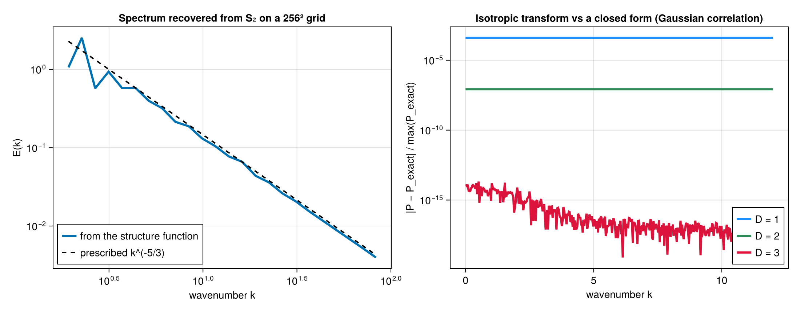
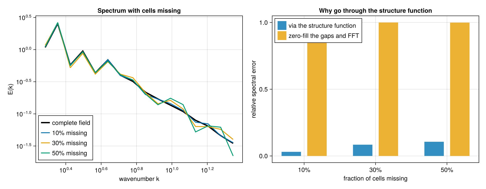
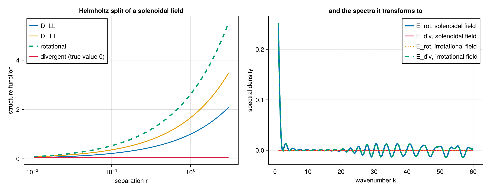

# Walkthrough: from a velocity field to a cascade diagnostic

This page runs one analysis end to end — six structure-function invariants, the Helmholtz split,
the directional signal, and the spectral slope — on fields whose answers are known in advance, so
every number below can be checked rather than taken on faith.

Two acts, because the two data layouts want different algorithms. Scattered points go through the
pair loop; a uniform grid goes through the transform, which is roughly two orders of magnitude
faster and exact.

## Act 1 — scattered points

A superposition of Fourier modes whose polarisations are perpendicular to their wavevectors is
divergence-free by construction, so we know its divergent part is zero before computing anything.

```julia
using StructureFunctions: StructureFunctions as SF, Calculations as SFC,
    StructureFunctionTypes as SFT
using ComputationalBackends: ComputationalBackends as CB
using StaticArrays: StaticArrays as SA
using Random

function solenoidal_field(x; kmin = 3, kmax = 40, seed = 42)
    rng = Random.MersenneTwister(seed)
    N = size(x, 2)
    u = zeros(2, N)
    for a in -kmax:kmax, b in -kmax:kmax
        k = sqrt(a^2 + b^2)
        (kmin <= k <= kmax && a > 0) || continue
        amp = k^(-4 / 3)                      # gives an E(k) ~ k^(-5/3) shell energy
        φ = 2π * rand(rng)
        ex, ey = -b / k, a / k                # perpendicular to k, hence divergence-free
        for p in 1:N
            c = amp * cos(a * x[1, p] + b * x[2, p] + φ)
            u[1, p] += c * ex
            u[2, p] += c * ey
        end
    end
    return u
end

Random.seed!(9)
x = 2π .* rand(2, 6000)
u = solenoidal_field(x)
```

### Six invariants in one pass

The six second- and third-order invariants share a pair loop, a separation and a bin, so computing
them together costs one pass rather than six.

```julia
bins = collect(10 .^ range(log10(0.05), log10(2.0); length = 25))
res = SFC.calculate_structure_functions_single_pass(x, u, bins; backend = CB.SerialBackend())

keys(res)
# (:S2, :L2, :T2, :S3, :L3, :L1T2, :helmholtz)
```

That is 18.0 million pairs. Culling is on by default, so pairs beyond the last bin edge are never
enumerated.

### The Helmholtz split

The rotational and divergent parts of the second-order structure function come from the
longitudinal and transverse components, and arrive with the single pass.

```julia
h = res.helmholtz
D_rot = h.rotational_sums ./ max.(h.rotational_counts, 1)
D_div = h.divergent_sums ./ max.(h.divergent_counts, 1)

occ = isfinite.(res.L2.values) .& (h.rotational_counts .> 0)
maximum(abs, D_div[occ]) / maximum(res.L2.values[occ])   # 0.1195
maximum(abs, (D_rot .+ D_div .- (res.L2.values .+ res.T2.values))[occ])   # 2.2e-16
```

The field is solenoidal, so the true divergent part is zero and the residual `0.1195` is the
decomposition's own quadrature floor. It comes from the integral's lower limit: the cumulative
integral starts at the first bin's abscissa rather than at zero, and the omitted segment carries
real weight when the integrand rises at small separation. Narrowing the first bin shrinks it —
running the same field over `log10(0.05)` to `log10(2.0)` with a band of `kmin = 4, kmax = 20`
instead gives `0.0317`.

The energy identity `D_rot + D_div = D_LL + D_TT` holds to `2.2e-16`. Note that this identity is
**not** a check on the split: it is preserved by a whole family of errors in it, including a
factor-of-`r` defect this package once carried. See [Validation](validation.md).

### Directional output

The second histogram axis can bin the angle between the separation and a reference direction
instead of the operator's value, which turns `S(r)` into `S(r, θ)` without touching the kernel.

```julia
ua = zeros(2, size(x, 2))
ua[1, :] .= sin.(6 .* x[1, :])          # varies along x only

ang = collect(range(0, π; length = 5))
dj = collect(range(0.0, 1.2; length = 6))
j = SFC.serial_calculate_structure_function(
    SFT.L2SFType(), x, ua, dj, ang;
    second_axis = SFC.SeparationAngleAxis(SA.SVector(1.0, 0.0)),
    verbose = false, show_progress = false)
```

Averaged over separation, the four angular bins give

| θ | ⟨δu_L²⟩ |
|---|---|
| [0, π/4) | 0.806 |
| [π/4, π/2) | 0.250 |
| [π/2, 3π/4) | 0.252 |
| [3π/4, π) | 0.801 |

a 3.2× anisotropy, in the right sense: the field varies only along `x`, so separations aligned with
`x` see the full increment. The perpendicular bin is not zero because it spans 45°–90°, and only
*exactly* perpendicular separations have an identically zero increment.

The angle folds to `[0, π)` because swapping a pair's ends flips both the separation and the
increment, and no structure function distinguishes the two.

### The exact laws

The inertial-range laws are inversions of a measured moment. Each takes the specific moment it is
stated for, and they are not interchangeable:

```julia
r = collect(range(0.2, 3.0; length = 8))
SF.KHM.epsilon_from_four_fifths(r, -(4 / 5) * 0.85 .* r)[1]    # 0.850000
```

Applied to this field, though, the answer is that there is nothing to recover: a synthetic Gaussian
field has no energy cascade, so its third-order moments are consistent with zero
(`⟨δu_L³⟩ = 1.3e-2` against `⟨δu_L²⟩ ≈ 1`, i.e. sampling noise). A meaningful `ε` needs data with a
genuine flux — a forced simulation or an observational record.

## Act 2 — a uniform grid

On a grid the same quantity is available by transform, exactly, for every lag at once.

```julia
using SpectralBackends: SpectralBackends as SB
using FFTW: FFTW

function spectral_field(n; kmin, kmax, seed = 5)
    rng = Random.MersenneTwister(seed)
    Fx = zeros(ComplexF64, n ÷ 2 + 1, n)
    Fy = zeros(ComplexF64, n ÷ 2 + 1, n)
    for ix in 1:(n ÷ 2 + 1), iy in 1:n
        kx = ix - 1
        ky = iy - 1 <= n ÷ 2 ? iy - 1 : iy - 1 - n
        k = sqrt(kx^2 + ky^2)
        (kmin <= k <= kmax) || continue
        amp = k^(-4 / 3) * n^2
        ph = exp(im * 2π * rand(rng))
        Fx[ix, iy] = amp * ph * (-ky / k)     # perpendicular to k, so k·û = 0
        Fy[ix, iy] = amp * ph * (kx / k)
    end
    u = zeros(2, n, n)
    u[1, :, :] .= FFTW.irfft(Fx, n)
    u[2, :, :] .= FFTW.irfft(Fy, n)
    return u
end

n = 256
dx = 2π / n
u = spectral_field(n; kmin = 2, kmax = 100)

bins = collect(10 .^ range(log10(1.5 * dx), log10(2.6); length = 33))
plan = SFC.squared_digitize_plan(bins)
sums = zeros(Float64, SFC.n_histogram_bins(plan))
counts = zeros(Int, length(sums))
sched = SFC.UniformLagSchedule((n, n), (dx, dx), (true, true))

SFC.gridded_sweep!(sums, counts, SFT.L2SFType(), u, sched, bins, Val(2),
                   SB.FastFourierTransformSpectralBackend())
```

This bins **1.154 billion pairs**. On eight dedicated cores the transform takes `0.014 s`; the
direct lag sweep over the identical configuration takes `1.767 s`, a factor of 126, and the two
agree to round-off. Passing `SB.AutoSpectralBackend()` costs both and picks the cheaper one, which
is not always the transform — at small cutoffs the sweep wins.

### The spectral slope

```julia
mids = SF.midpoints(bins)
D = sums ./ max.(counts, 1)
slope(i) = (log(D[i+1]) - log(D[i-1])) / (log(mids[i+1]) - log(mids[i-1]))
```

| r | D_LL | local slope |
|---|---|---|
| 0.088 | 0.882 | 1.02 |
| 0.130 | 1.241 | 1.05 |
| 0.195 | 1.766 | 0.72 |
| 0.222 | 1.941 | 0.74 |
| 0.254 | 2.149 | 0.74 |
| 0.290 | 2.366 | 0.73 |
| 0.331 | 2.610 | 0.71 |
| 0.379 | 2.858 | 0.66 |
| 0.841 | 4.536 | 0.47 |
| 2.134 | 5.778 | 0.01 |

The three limbs are all physical: `r²` below the smallest excited eddy, a plateau near `2/3` across
the excited band, and saturation at `0` beyond the largest. A prescribed `E(k) ~ k^(-5/3)` implies
`D_LL ~ r^(2/3)`, and the measured plateau sits at `0.71 ± 0.03` — the excess is the finite width of
the band, which leaves the plateau squeezed between the two limbs rather than flat.

This is worth stating plainly, because it is the honest limit of the method: a scattered-point
sample cannot show this at all. Its small-scale end is capped by the mean point spacing, so a
one-decade band gives a slope that declines monotonically through `2/3` without ever plateauing, and
fitting a single exponent to it returns whatever the fit window happens to select. Resolving a
scaling range needs the dynamic range a grid provides.

## Act 3 — into spectral space

A structure function and a spectrum carry the same second-order information, and the package
converts between them. Which route to use depends on the data, and the difference is not cosmetic.

### From a grid: exact

On a grid the transform runs over the whole lag space, so no direction is averaged over and no
separation is binned.

```julia
using SpectralBackends: SpectralBackends as SB
using FFTW: FFTW

kaxes, density = SFC.gridded_spectrum(u, sched, Val(2),
                                      SB.FastFourierTransformSpectralBackend())

edges = collect(10 .^ range(log10(1.0), log10(100.0); length = 25))
mids, E = SFC.shell_average(kaxes, density, edges)
```

That takes `0.024 s` on the 256² field, and the variance it implies matches the field's own to every
digit printed — `5.63136` either way. The recovered spectrum has the slope it was built with:

| k | E(k) | local slope |
|---|---|---|
| 2.89 | 6.50e-01 | −2.02 |
| 5.13 | 3.40e-01 | −1.84 |
| 9.13 | 1.32e-01 | **−1.65** |
| 16.23 | 6.06e-02 | −1.53 |
| 28.86 | 2.29e-02 | −1.60 |
| 51.33 | 8.87e-03 | **−1.65** |



against the prescribed `k^(-5/3) = k^(-1.667)`. Note this is the *same information* as Act 2's
`D_LL ~ r^0.71`: the two routes are consistent statements about one field, and `ζ` and the spectral
slope are related by `E(k) ~ k^(-(ζ+1))`.

The reason to reach a spectrum through the structure function — rather than just transforming the
field — is **missing data**. With cells absent the field's own transform is meaningless, while the
structure function is still an unbiased average over surviving pairs. Measured against the
complete-field spectrum on a 48² grid:

| cells missing | via the structure function | zero-fill the gaps and FFT |
|---|---|---|
| 10 % | 0.015 | 0.191 |
| 30 % | 0.036 | 0.543 |
| 50 % | **0.041** | **0.769** |



### From scattered points: isotropic, and one assumption

Scattered data has no lag grid, so the transform integrates against a dimension-appropriate kernel —
`cos` on a line, `J₀` on a plane, `sin(x)/x` in a volume — and averages over the directions of the
separation:

```julia
using Bessels: Bessels      # only the 2-D kernel needs it; 1-D and 3-D are elementary

kq = collect(range(1.0, 30.0; length = 200))
P = SFC.isotropic_spectrum(res.S2, kq, Val(2))     # res.S2 is the trace, from Act 1
```

That assumes the pairs behind each bin sample direction uniformly. Scattered points do. A
rectilinear grid does **not** — its separations are biased toward the lattice axes — which is why
gridded data should take the lag-space route above rather than this one.

### Splitting the spectrum

The Helmholtz decomposition from Act 1 transforms the same way, giving the rotational and divergent
kinetic-energy spectra separately — the reason the package carries the decomposition at all:

```julia
spec = SFC.helmholtz_spectra(res.helmholtz, kq)
maximum(abs, spec.divergent) / maximum(abs, spec.rotational)   # 0.0669
```

The Act 1 field is solenoidal by construction, so its divergent spectrum should vanish; 6.7 % of the
rotational is the decomposition's own quadrature floor carried through the transform.

Because `D_rot + D_div = D_LL + D_TT` exactly and the transform is linear, the two spectra sum to the
spectrum of the trace — an identity that holds whatever the field is, and the one the tests assert.


