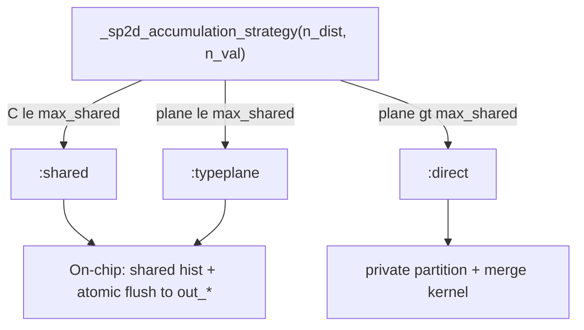

# Six-invariant single-pass 2D (SP2D) — HTP-EJ GPU path

**Code:** `ext/gpu/kernels_2d_direct.jl`, `ext/gpu/sp2d_accumulation_strategy.jl`, `ext/gpu/value_digitize_plans.jl`, `ext/gpu/launch.jl`, `ext/gpu/workspace.jl`
**Benchmark:** `gpu/benchmark_2d_grid_scaling.jl` (run on GPU allocation)
**Tests:** `test/test_gpu_sp2d_partitioned.jl` (KA.CPU parity for `:shared`, `:typeplane`, `:direct`)

This document describes how production **six-invariant single-pass 2D** histograms work on GPU,
why the design looks the way it does, and what is *not* solved yet.

---

## What SP2D computes

For each unordered pair `(i, j)` with `i < j` (same tiled128 schedule as 1D / joint 2D):

1. Distance `dist` → **one** distance-bin index.
2. Six invariant structure-function samples:
   `S2 = |δu|²`, `L2 = δu_L²`, `T2 = |δu_T|²`,
   `S3 = δu_L |δu|²`, `L3 = δu_L³`, and `LT2 = δu_L |δu_T|²`.
3. Each sample → **value-bin** index → accumulate into `sums[t, dist_bin, val_bin]` and counts.

Output shape: `(6, n_dist, n_val)`. One kernel launch covers all six invariants (vs six separate `joint_2d` passes).

Production value routing uses typed digitize plans (`GPUValueDigitizePlan`: linear, log, Inf-padded, per-column, etc.).

---

## Two algorithms (three `accum_mode` labels)

The accumulation strategy is frozen per workspace in `SP2DAccumulationStrategy` from the **48 KiB default** shared-memory budget (`SF_GPU_SMEM_DEFAULT`). No per-grid tuning.

| `accum_mode` | When | Pair traversal | Block-end output |
|--------------|------|----------------|------------------|
| `:shared` | Full `C = 6·n_dist·n_val` fits in smem | **1×** tile loop | On-chip flush → `out_*` (`@atomic`, joint pattern) |
| `:typeplane` | One `n_dist×n_val` plane fits, not all 6 types | **`n_type_passes`** tile loops (`types_per_pass` types per pass) | Same on-chip flush each pass |
| `:direct` | Even one plane does not fit | **1×** tile loop, global atomics to block-private slab | private partition + merge kernel → `out_*` |

`:shared` and `:typeplane` are the **same on-chip family** (shared histogram during the pair loop, flush like `joint_2d`). They differ only in how many type planes fit per pass.

`:direct` is the fallback when smem cannot hold even `n_dist × n_val` cells (large bin grids).

`needs_partition_merge == (accum_mode == :direct)` — host routing uses this single boolean (`_launch_sp2d_onchip!` vs `_launch_sp2d_direct_partitioned!`).

### On-chip flush (current production path for typical grids)

Before the on-chip fix, **all** modes incorrectly routed through a block-private slab and serial merge (~7 ms + ~2 GB memset at `N=20k`), even when shared memory already held the histogram. That made e2e ≈ `6×joint_2d` with no margin.

**Now:** `:shared` / `:typeplane` write directly to `out_sums_dev` / `out_cnts_dev` at block end (mirror `TiledStructureFunctionKernels.jl` joint flush). No private allocation, no merge.

### Direct path

When planes do not fit in 48 KiB, pairs accumulate with **global atomics** into `(6, n_dist, n_val, n_tile_blocks)` private partitions, then `_launch_merge_sp2d_partitions!` (serial by default; `ENV["SP2D_MERGE"]=parallel` for experiments only).

---

## Host plumbing

| Piece | Role |
|-------|------|
| `GPUSFWorkspace(...; kind=:single_pass_2d)` | Device `out_*`, frozen `sp2d_accumulation_strategy`, cached `sp2d_pair_kernel` (typed dist + val plan) |
| `_sp2d_resolve_pair_kernel` | One-time kernel bind per workspace; ephemeral calls resolve once per launch |
| `reset_histogram!` | Zeros `out_*` always; zeros private partitions only when `needs_partition_merge` |
| `_ensure_sp2d_partition_bufs!` | Allocates private partitions only for `:direct` |

Distance bins must be `LinearBinEdges` or `LogBinEdges` for the HTP-EJ tiled path. Other distance-bin forms route to explicitly supported fallback kernels or throw.

---

## Benchmark gate (`benchmark_2d_grid_scaling.jl`)

Compares **end-to-end** `gpu_calculate_structure_functions_single_pass_2d!` against **`6 × joint_2d`** (six separate single-type 2D runs). This is the production-relevant gate (six histogram tensors in one API call).

**Asymmetry (intentional):** joint reference uses one `L2SFType` + `InfPaddedBinEdges` value edges (same family as SP2D); SP2D uses six invariant samples + typed value digitize plans. Joint value axis still uses general edge search until a typed joint kernel exists. The gate is conservative.

Example A100 (`N=20000`) after on-chip flush:

| Grid | Mode | 6×joint | SP2D e2e | Merge |
|------|------|---------|----------|-------|
| 20×22 | `:shared` | 53 ms | **28 ms** | 0 |
| 50×52 | `:typeplane` 2×4 | 64 ms | **43 ms** | 0 |

Log: `test/debug/sp2d_phase_profile.log`

---

## Why is SP2D still slower than a naive “2× digitize” story?

A common intuition: 2D joint needs **two** digitizations per pair (distance + value); SP2D should be “about twice” a 1D distance-only path, or not much worse than `joint_2d`, when everything fits in shared memory.

**That bound is too optimistic.** Per pair, SP2D actually does:

| Work | `joint_2d` | `sp1d` (6 invariants) | `sp2d` (6 invariants) |
|------|------------|------------------|------------------|
| Distance digitize | 1 | 1 | 1 |
| Value digitize | 1 | 0 | **6** (one per invariant) |
| SF values computed | 1 | 6 | 6 |
| Histogram cells touched | 1 | 6 (1D bins) | 6 (2D bins) |
| Tile traversals | 1 | 1 | **`n_type_passes`** (e.g. 4 on 50×52) |

Additional costs not present in single-type joint:

- **Six value digitizations** (Inf-padded / per-column routes are heavier than one shared linear digitize).
- **Typeplane multi-pass:** when `C = 6·n_dist·n_val` exceeds smem, the tile schedule is replayed `n_type_passes` times with `@synchronize` between zero / pair / flush phases — not amortized to a single pass.
- **Larger on-chip histogram:** static `@localmem` width is `max_shared_cells` (compile-time), not `C`; zero/flush loops scale with active cells.
- **Block-end flush:** on-chip modes use global `@atomic` adds into `(8, n_dist, n_val)` — correct and cheap vs merge, but not free at large `C` and many tile blocks.
- **Host e2e:** staging, `reset_histogram!`, optional `Array(out_sums_dev)` download (~3 ms in recent profiles).

So the fair structural comparisons are:

- vs **`6 × joint_2d`** — current production gate (passed with margin on tested grids).
- vs **`sp1d`** — SP2D adds an entire value axis + six value digitizations; ratios of 2–6× are expected, not a bug by themselves.

A tighter *theoretical* target for “2D overhead only” would be **one** `joint_2d` plus ~6× value-digitize work in a fused kernel — not implemented; today we pay full six-invariant structure in one tiled kernel.

---

## Future performance work (not scheduled)

Ordered roughly by expected impact vs implementation risk:

1. **Typeplane pass fusion** — reduce `@synchronize` / zero / flush boundaries between `n_type_passes` (KA segment limits apply).
2. **Warp-aggregated shared atomics** — reduce hot-bin contention in shared histogram during pair loop (NVIDIA/CUB-style).
3. **Digitize / accumulate fusion** — compute eight `vals` once; batch or vectorize value-bin lookups; avoid redundant Inf-padded branches where plans allow.
4. **Host hot path** — reuse download buffers in workspace; avoid per-call `Array(out_sums_dev)` if profiling shows it matters.
5. **Optional smem budget** — portable override above 48 KiB (e.g. 96 KiB) with explicit occupancy measurement; not assumed win.
6. **Direct-mode merge** — parallel merge remains comparison-only; serial merge is production default.
7. **Strategy naming cleanup** — optional rename `:shared`/`:typeplane` → single `:onchip` label with `n_type_passes` (cosmetic).

Re-profile after each change with `benchmark_2d_grid_scaling.jl` across several `(n_dist, n_val)` points, not a single production grid.

---

## Related docs

- [GPU_2d_joint_sf_plan.md](GPU_2d_joint_sf_plan.md) — single-type joint 2D tiled path
- [docs/gpu.md](../docs/gpu.md) — workspace, slice batches, testing tiers
